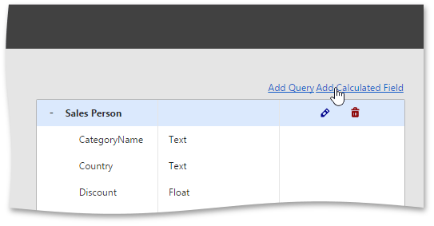
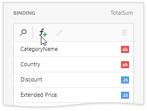
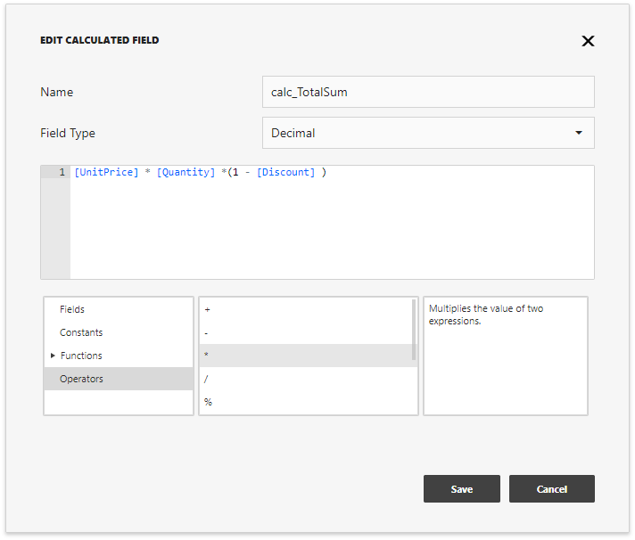

# Calculated Fields

The Web Dashboard control provides the capability to create calculated fields that allow you to apply complex expressions to data fields obtained from the dashboard's data source. As a result, you can use these fields in data visualizations as regular data source fields.

Note that calculated fields are not supported for the [OLAP](../bind-dashboard-items-to-data/bind-dashboard-items-to-data-in-olap-mode.md) data source.

You can add a new calculated field based on the existing data source fields after you have created a data source. 

* [Creating a Calculated Field](#create)
* [Editing a Calculated Field](#edit)

## Creating a Calculated Field

You can creates calculated fields both in the **Data Sources** page and from the **Binding** panel.

- Go to the [dashboard menu](../ui-elements/dashboard-menu.md) and open the **Data Sources** page. Select a required data source (and the required [query](working-with-sql-data-sources/manage-sql-queries.md)/data member, if applicable) and click the **Add Calculated Field** button to create a calculated field.

	

- Open the [Binding](../ui-elements/dashboard-item-menu.md) panel, go to the **Binding** section and click the **Add calculated field** button (the  icon).

	

This invokes the **Edit Calculated Field** dialog, which allows you to construct the required expression.

- Use the **Name** option to change the default field name.
- Use the **Field Type** option to specify the required calculated field type.  

The following elements are available for creating expressions:

Element | Description 
---------|----------
 Fields | Contains available fields and [dashboard parameters](../data-analysis/dashboard-parameters.md). 
 Constants | Contains boolean variables. 
 Functions | Contains different types of functions including [aggregate](../data-analysis/aggregations.md).
 Operators | Allows you to select operators from the list. 

After creating the expression, click **Save** to creates a new calculated field and display it in the [Field List](working-with-sql-data-sources/manage-sql-queries.md). This type of a field is indicated with the **_f_** glyph.

## Editing a Calculated Field

You can configure calculated fields both in the **Data Sources** page and from the **Binding** panel:

- To edit the created field using the **Data Sources** page, click the calculated field's **Edit** button (the  icon). 
- In the **Binding** section, select the calculated field you want to edit and click the **Edit** button (the  icon).

This invokes the **Edit Calculated Field** dialog. You can change the calculated field's name, type or edit the current expression.

To delete the calculated field, use the calculated field's **Delete** button (the  /  icons).