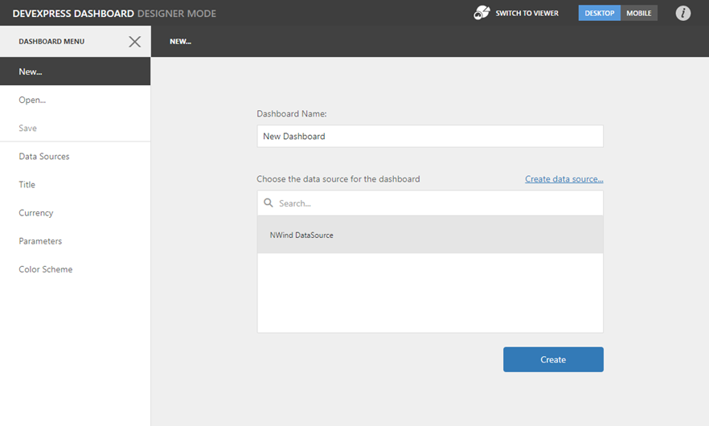

# Connect to an Existing Data Source
The Web Dashboard allows you to connect a dashboard to one of the existing data sources or add these data sources to the dashboard's data sources collection.

## Connect a New Dashboard to an Existing Data Source
When you [create](create-a-new-data-source.md) a new dashboard, the **New** page of the [dashboard menu](../ui-elements/dashboard-menu.md) is invoked. You can select the existing data source from the list or create a [new data source](dashboard-data-source-wizard.md).

This action creates a new empty dashboard that is bound to data.  Now, you can [add dashboard items](../add-dashboard-items.md) and [bind them to data](../bind-dashboard-items-to-data.md).

## Add a New Data Source to the Existing Dashboard
You can add an existing data source to the dashboard. To learn more, see [Manage Data Sources](manage-data-sources.md).