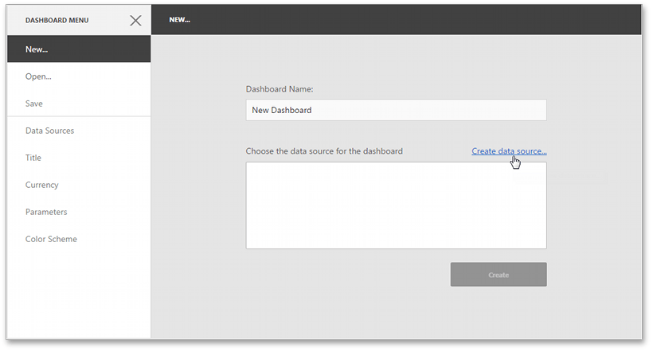
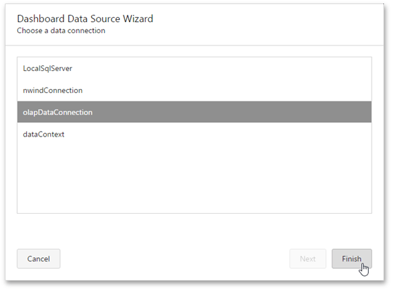

# Create a New Data Source
This topic describes how to create a new data source based on the existing data connection.

## Create a Data Source for a New Dashboard
After [creating](create-a-new-data-source.md) a new dashboard, the **New** page of the [dashboard menu](../ui-elements/dashboard-menu.md) is invoked. Click the **Create data source...** button to invoke the [Dashboard Data Source Wizard](dashboard-data-source-wizard.md) where you can select the required connection.

> [!NOTE]
> The SQL data connection requires a query or a stored procedure for further work. To learn more about managing queries, see [Manage SQL Queries](working-with-sql-data-sources/manage-sql-queries.md).

Click **Finish** to create a new data source based on the selected connection.

The next step is [connecting a dashboard to a data source](connect-to-an-existing-data-source.md).

## Create a Data Source for the Existing Dashboard
You can create a new data source based on the predefined connection for the existing dashboard. To learn more, see [Manage Data Sources](manage-data-sources.md).