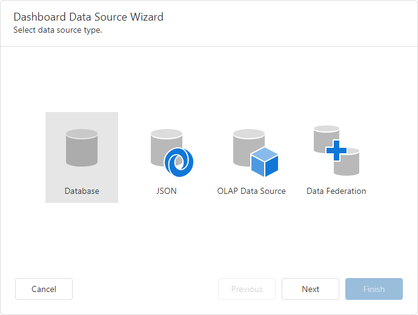

# Dashboard Data Source Wizard

The **Dashboard Data Source Wizard** allows you to create a new data source or edit the existing data sources.

To invoke this wizard, go to the **Data Sources** page of the [dashboard menu](../ui-elements/dashboard-menu.md) and click **Add** button.

In the invoked window choose the existing data sources or click **Create data source**....

 

On the start page, select the data source type. You can create a new dashboard data source based on a database, JSON data, or an OLAP cube.

* [Database](../provide-data/dashboard-data-source-wizard/specify-data-source-settings-database.md)

  Obtains data from all major data providers (Microsoft SQL Server, XML data, Microsoft Access, Oracle, etc.).

* [JSON](../provide-data/dashboard-data-source-wizard/specify-data-source-settings-json.md)

  Connects to JSON-formatted data.

* [OLAP Data Source](../provide-data/dashboard-data-source-wizard/specify-data-source-settings-olap.md) 

  Connects to OLAP cubes.

