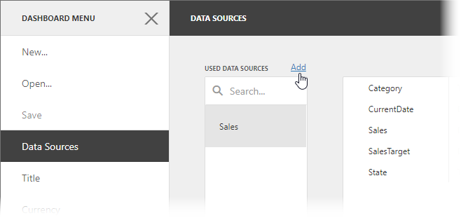
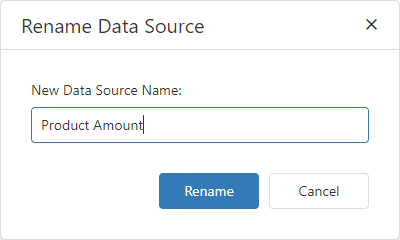

# Manage Data Sources
You can add a new data source to the current dashboard or remove existing data sources. To do this, open the [dashboard menu](../ui-elements/dashboard-menu.md) and go to the **Data Sources** page.

## Add a Data Source

To add a new data source, click **Add** next to the **Used Data Sources** list.

The **Add Data Source** window appears.

The window allows you to do the following:

| Action | Description |
|----------|----------|
| **Add an existing data source** | Select the data source and click the **Add** button.  |
| **Create a new data source** | Click **Create data source...**. It invokes the [Dashboard Data Source Wizard](dashboard-data-source-wizard.md) where you can create a new data source based on the predefined data connection. Then click **Add** to add the newly created data source to the dashboard data sources.  |

You can find the newly added data source in the **Used Data Sources** list.

## Manage Data Sources

Select a data source to manage it:

Click the **Rename** button () to rename the selected data source. The **Rename Data Source** dialog appears and you can enter a new name:

To remove an existing data source, select it and click **Remove** ().