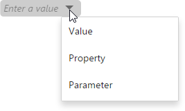

# Filter Queries
SQL queries constructed in the [Query Builder](../query-builder.md) can be filtered by including the _WHERE_ clauses to the query. Filtering can be applied to either underlying or aggregated data. You can also limit the number of returned records when filtering data.

To filter a query, deselect added tables and click the ellipsis button of the **Filter** field within the [Query Builder](../query-builder.md).

This will invoke the **Filter Editor** dialog, which allows you to build filter criteria.

You can create complex filter criteria with an unlimited number of filter conditions. These filter conditions can be arranged into groups with **And**, **Or**, **Not And**, and **Not Or** operators. The Filter Editor displays filter criteria as a tree-like structure, in which each node can be edited separately.

In the Filter Editor, you can compare a field value with the following objects.
* **Value** - represents a static value.
* **Property** - represents another field value.
* **Parameter** - represents a parameter value. Click the **Create new parameter** button to create a new parameter and specify its name. To learn how to configure the created parameter, see [Pass Query Parameters](pass-query-parameters.md).

To switch between values, click a down arrow glyph in the operand value placeholder to expand the list of available objects.

