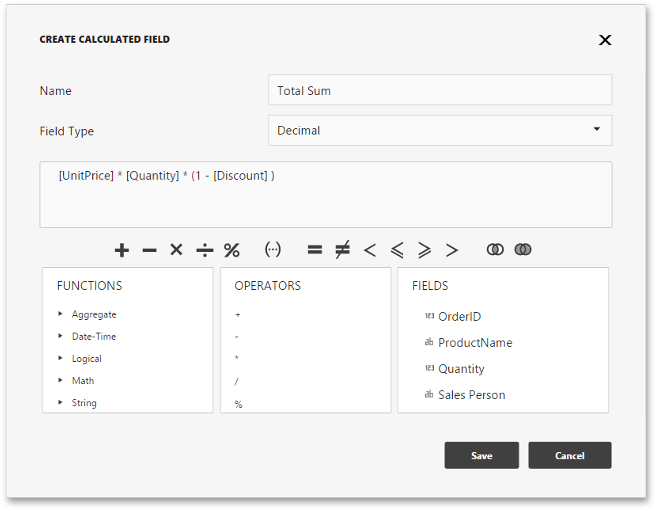
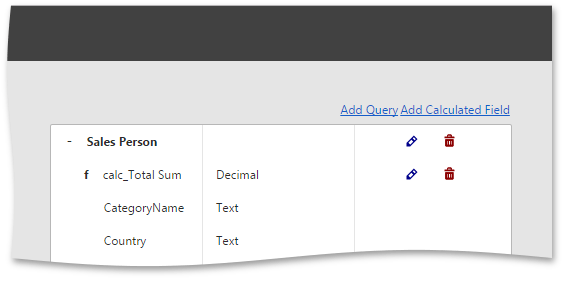

# Calculated Fields
The Web Dashboard provides the capability to create **calculated fields** that allow you to apply complex expressions to data fields obtained from the dashboard's data source. As a result, you can use these fields in data visualizations as regular data source fields.
* [Creating a Calculated Field](#create)
* [Editing a Calculated Field](#edit)

## <a name="create"/>Creating a Calculated Field
To create a calculated filed, open the [ dashboard menu](../../../../dashboard-for-web/articles/web-dashboard-designer-mode/ui-elements/dashboard-menu.md) and go to the **Data Sources** page. Select a required data source, then select a query and click the **Add Calculated Field** button.

This action invokes the **Create Calculated Field** dialog, which allows you to specify an expression that will be used to obtain calculated field values. Here you can construct the required expression.

To specify the required calculated field type use the **Type** option. To change the default name, use the **Name** option.

The following elements are available for creating expressions.
* The **Functions** section includes different types of functions including [aggregate](../../../../dashboard-for-web/articles/web-dashboard-designer-mode/data-analysis/aggregations.md).
* The **Operators** section allows you to select operators from the list.
* The **Fields** section contains available fields and [dashboard parameters](../../../../dashboard-for-web/articles/web-dashboard-designer-mode/data-analysis/dashboard-parameters.md).

After creating the expression, click **Save**. This creates a new calculated field in the Field List, indicated with the **f** glyph.

## <a name="edit"/>Editing a Calculated Field
To edit the created field, click the calculated field's **Edit** button (the  icon) on the Data Sources page. This action invokes the **Create Calculated Field** dialog. You can change the calculated field name, field type or edit the current expression.

You can delete the calculated field by clicking the calculated field's **Delete** button (the  icon).