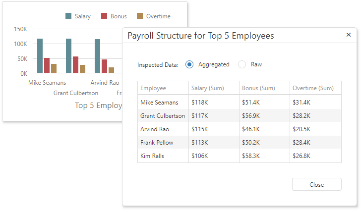

# Data Inspector
**Data Inspector** is a dialog window that contains two grids that display raw and aggregated data. You can switch from one grid to another with the radio group located at the window top. 

Aggregated Data:

Raw Data:

## Overview

To invoke the Data Inspector window, click the "Inspect Data" button  in the [dashboard item caption](../dashboard-layout/dashboard-item-caption.md) or select the "Inspect Data" context menu item. 

The "Inspect Data" button and menu item are initially hidden. You can inspect the raw or / and aggregated data depending on the Dashboard Designer configuration.

## Aggregated (Displayed) Data

The data shown as _Aggregated_ is retrieved from the dashboard item's data storage.
The columns are:

* [Dimensions](../designing-dashboard-items/grid/columns.md), except the **Sparkline**.
* [Measures](../designing-dashboard-items/grid/columns.md). A list of dimensions does not include unbound measures (the measures without a DataMember, such as [Totals](../designing-dashboard-items/grid/totals.md) and the number of points in a [Cluster](../designing-dashboard-items/geo-point-maps/clustering.md).
 * The [Sparkline](../designing-dashboard-items/grid/columns.md) is displayed as a column.

## Raw Data

Raw data is the dashboard item's underlying data. 