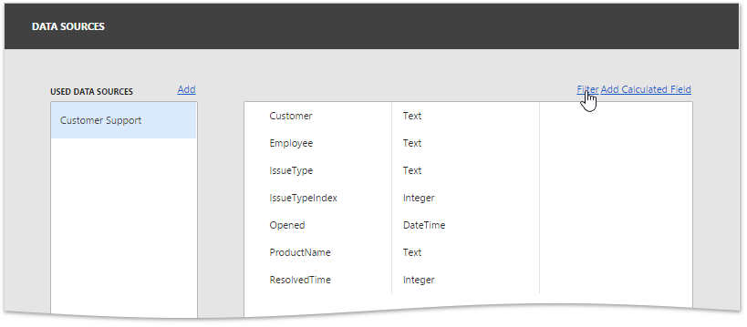
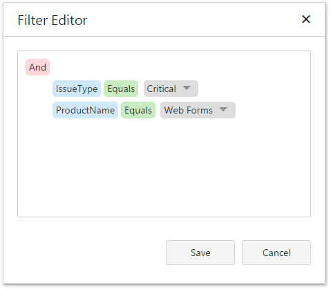

The Web Dashboard allows you to apply filtering to Excel and Object data sources.

## Apply Filtering
To apply filtering to a data source, open the [dashboard menu](../../../../dashboard-for-web/articles/web-dashboard-designer-mode/ui-elements/dashboard-menu.md), invoke the **Data Sources** page and click the **Filter** button.

This will invoke the **Filter Editor** dialog, which allows you to build filter criteria with a convenient tree-like interface.

## Pass Parameter Values
You can use the Filter Editor to filter a data source according to the current parameter value. To learn more, see the [Dashboard Parameters](../../../../dashboard-for-web/articles/web-dashboard-designer-mode/data-analysis/dashboard-parameters.md) topic.