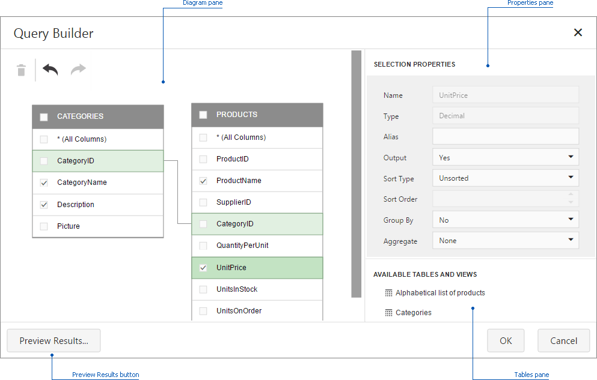
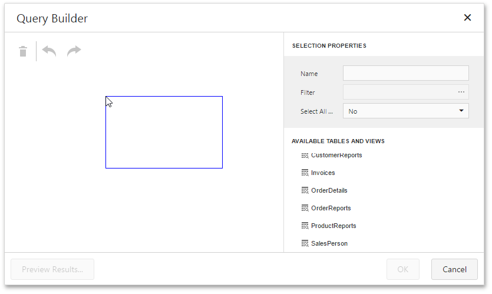
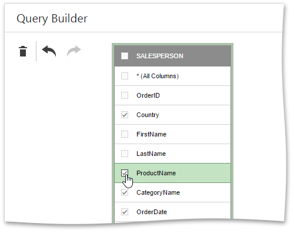
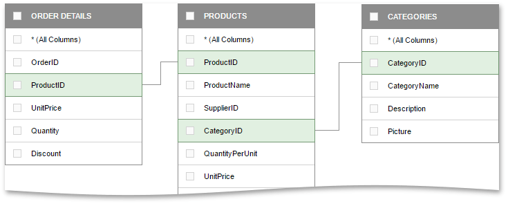
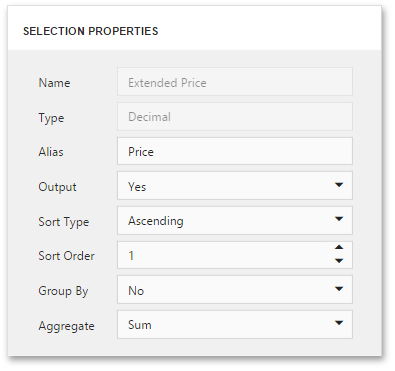

# Query Builder
In the **Query Builder** dialog, you can add data tables and views to the data source, and select which columns to include. The **Query Builder** automatically joins the related tables, so all you need to do is drag-and-drop.

This topic consists of the following sections.
- [Add Tables](#add-tables)
- [Join Tables](#join-tables)
- [Edit Column Settings](#edit-column-settings)
- [Filter Data](#filter-data)
- [Preview Data](#preview-data)

## Add Tables
To add the required tables/views to a data source, drag-and-drop it from the **Tables** pane onto the **Diagram** pane.

Then, select the required columns.

To delete the unnecessary table, select it and click the **Delete** button (the  icon).

You can cancel or repeat the action using the **Undo**/**Redo** buttons (the  and  icons).

## Join Tables
When you drop a table that has a relationship at the database level with any of the recently added tables, the **Query Builder** joins these tables automatically.

You can create a relationship between two tables manually by dragging a column in one table to a related column in a different table. A relationship line will be drawn between the two tables.

The Query Builder allows you to change the join type (if necessary). For this, select the relationship line and use the **Join type** combo box in the Properties pane. An **Inner join** and **Left outer join** are supported.

To delete the unnecessary relationship, select the relationship line and click the **Delete** button (the  icon).

## Edit Column Settings
To edit a column setting, select the required column in a table. Then, use the **Properties** pane to specify the column setting.

The following settings are available for each column.

* The **Name** field displays the selected column name.
* The **Type** field displays the selected column type.
* The **Alias** field allows you to specify the column alias.
	
	> [!NOTE]
	> Note that aggregated columns should always have an alias.
* The **Output** field allows you to choose whether to include the selected column to the query.
* Use **Sort Type** to specify the sort order of column values.
* The **Sort Order** field allows you to specify the order in which several columns are sorted.
* The **Group By** option allows you to group data by the values of the selected column.
* The **Aggregate** field allows you to specify the aggregate function used to aggregate column values.
	
	> [!NOTE]
	> Note that you should apply aggregation/grouping either to all columns or to none of them.

## Filter Data
The Query Builder allows you to filter a query. To do this, deselect tables and click the ellipsis button in the appeared **Filter** field in the **Properties** pane. This invokes the **Filter Editor** dialog, which provides a visual interface for constructing a filter string.

To learn more, see [Filter Queries](working-with-sql-data-sources/filter-queries.md).

## Preview Data
The Query Builder allows you to preview data for the created SQL query. To do this, click the **Preview Results...** button. This invokes the [Data Preview](preview-data.md) window containing data returned after executing the query.