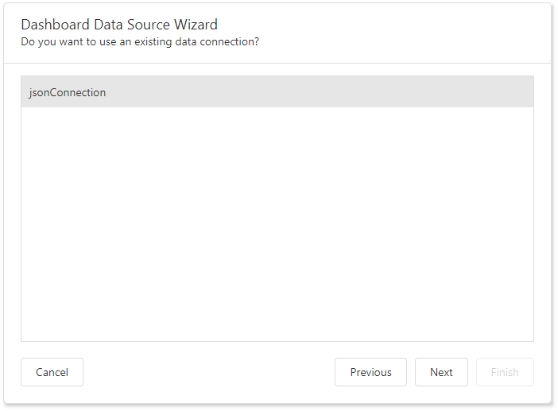

# Specify Data Source Settings (JSON)

The following pages are available for the JSON data source type: 

## Create a New Data Connection

If you are allowed to create new JSON data connections, the "Choose a data connection" page looks as follow:

Select a new data connection on the "Choose Connection (JSON)" page and click **Next**.

## Configure a New Data Connection

On the next page, specify the connection name and select the JSON source type:

* **Web Service Endpoint (URI)**

   A URL to a file in the JSON format. You can also specify the Web Service Endpoint's request parameters (username and password, HTTP headers, or query parameters)

* **JSON String**

   A string that contains JSON data. You can also use the Upload JSON button to load content from the selected JSON file.

Click **Next** to proceed to the "[Select Data Fields](#select-data-fields)" page.

## Select an Existing Data Connection

If you are not allowed to create new JSON data connections, the "Choose a data connection" page looks as follow: 

Select an existing connection from the list and click **Next** to proceed to the "Select Data Fields" page.

## Select Data Fields

The "Select data fields" page allows you to include / exclude data fields used in a JSON data source.

 

 Click **Finish** to create a JSON data source.

