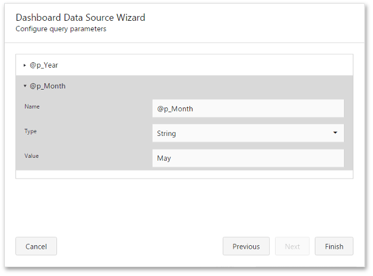

# Stored Procedures
If you use a stored procedure to supply the dashboard with data, you should specify the stored procedure parameters. In the [Dashboard Data Source Wizard](../dashboard-data-source-wizard.md) dialog, select the required stored procedure and click **Next**.

On the next page, you can configure the parameters.

The following parameter settings are available.
* **Name** - Displays a parameter's name.
* **Type** - Specifies the parameter's type.
* **Value** - Specifies the parameter's value. If the parameter type is set to _Expression_, you can invoke the **Expression Editor** dialog to specify the required expression. For example, you can select an existing [dashboard parameter](../../data-analysis/dashboard-parameters.md) to pass to the stored procedure.

Click **Finish** to complete query modifications.