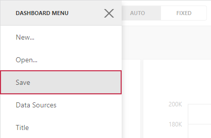

# Save a Dashboard
The Web Dashboard provides the capability to save a dashboard definition (dashboard items, data source, data binding and layout settings, etc.) to an XML definition. This can be accomplished in the following ways.
* You can save the dashboard definition manually. For this, open the [dashboard menu](ui-elements/dashboard-menu.md) and click **Save**.
	
	
	
	The following message indicates that you have successfully saved the dashboard.
	
	
* The dashboard definition can be saved when the currently opened dashboard is closed (for instance, the page containing the Web Dashboard is closed, a new dashboard is created or a different dashboard is [opened](open-a-dashboard.md)). By default, a save confirmation dialog will be invoked.
	
	

To learn how to open the saved dashboard, see [Open a Dashboard](open-a-dashboard.md).