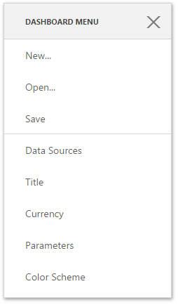

# Dashboard Menu
The dashboard menu allows you to create, save or open dashboards and invokes pages containing global dashboard settings. To invoke this menu, use the **Dashboard Menu button** on the [Toolbox](toolbox.md).

The dashboard menu consists of the following buttons.

| Button | Description | Shortcut |
|---|---|---|
| **New...** | Use this button to create a new dashboard. The invoked **New...** page allows you to set a dashboard name, choose an existing data source for this dashboard or create a new one. To learn more, see [Create a Dashboard](../create-a-dashboard.md). | Alt+N |
| **Open...** | This button allows you to [open](../open-a-dashboard.md) the existing dashboards. | Alt+O |
| **Save** | Use this button to [save](../save-a-dashboard.md) the current dashboard. | Alt+S |
| **Data Sources** | This button opens the **Data Sources** page where you can configure dashboard _data sources_. To learn more, see [Manage Data Sources](../provide-data/manage-data-sources.md). | Alt+A |
| **Title** | This button opens the **Title** page where you can set a [dashboard title](../dashboard-layout/dashboard-title.md) and specify its settings like title visibility, alignment, etc. | Alt+T |
| **Currency** | This button opens the **Currency** page. Here you can specify the **currency format** for the entire dashboard. To learn more about formatting, see [Formatting Data](../data-shaping/formatting-data.md). | Alt+C |
| **Parameters** | This button invokes the **Parameters** page containing a list of **dashboard parameters** and their settings. To learn more about parameters, see [Dashboard Parameters](../data-analysis/dashboard-parameters.md). | 	Alt+P |
| **Color Scheme** | This button opens the **Color Scheme** page where you can customize a **global color scheme** that provides consistent colors for identical values across the dashboard. To learn more about coloring, see [Coloring](../appearance-customization/coloring.md). | - |