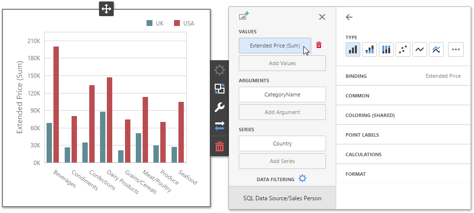

# Data Item Menu
The data item menu allows you to add measures and dimensions and configure settings related to the selected data item. For example, you can [specify a data field](../../../../dashboard-for-web/articles/web-dashboard-designer-mode/binding-dashboard-items-to-data.md), change a data item type, perform [data shaping operations](../../../../dashboard-for-web/articles/web-dashboard-designer-mode/data-shaping.md) and [advanced data analysis](../../../../dashboard-for-web/articles/web-dashboard-designer-mode/data-analysis.md), etc.

To invoke this menu, click a data item placeholder or the required data item in the dashboard item's [Bindings](../../../../dashboard-for-web/articles/web-dashboard-designer-mode/ui-elements/dashboard-item-menu.md) menu.

