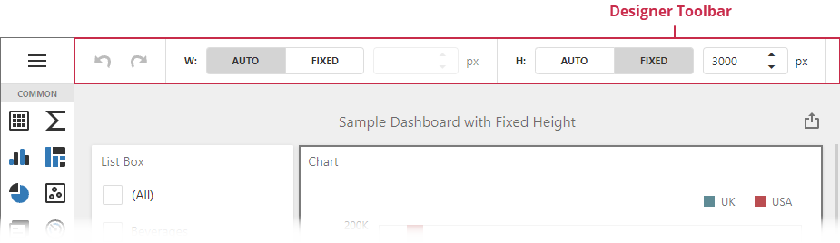

## Designer Toolbar

The **Designer Toolbar** allows you to access frequently used commands with a single click when the Web Dashboard operates in [Designer](../../web-dashboard-designer-mode.md) mode.

The default Designer Toolbar displays layout options and undo/redo buttons.

