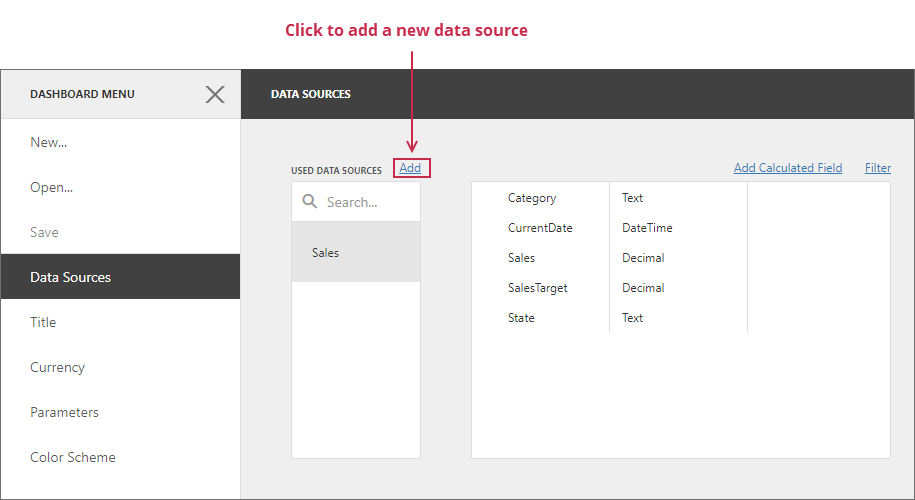
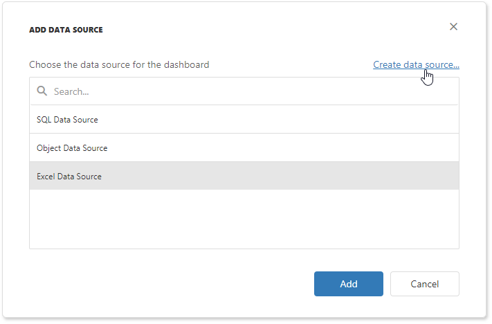
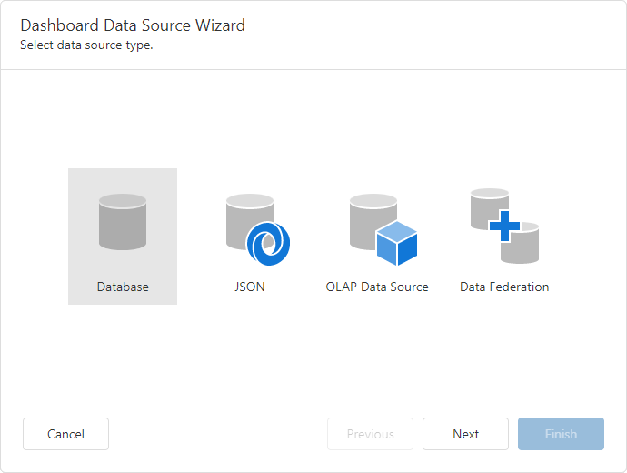

# Dashboard Data Source Wizard

The **Dashboard Data Source Wizard** allows you to configure a data source, retrieve its data, and add the created data source to a dashboard.

To invoke this wizard, open to the **Data Sources** page in the [dashboard menu](../dashboard-menu.md) and click **Add**:

In the invoked window, click **Create data source**:

On the start page, select the data source type:

You can create a new data source based on a database, JSON data, an OLAP cube, or create a federated data source. Click **Next** to proceed to the next wizard page depending on the selected data source type:

* [Database](dashboard-data-source-wizard/specify-data-source-settings-database.md)

  Obtains data from all major data providers (for example, Microsoft SQL Server, XML data, Microsoft Access, and Oracle).

* [JSON](dashboard-data-source-wizard/specify-data-source-settings-json.md)

  Connects to JSON-formatted data.

* [OLAP Data Source](dashboard-data-source-wizard/specify-data-source-settings-olap.md) 

  Connects to OLAP cubes.

* [Data Federation](dashboard-data-source-wizard/specify-data-source-settings-olap.md) 

  Creates a federated data source from the existing data sources.
