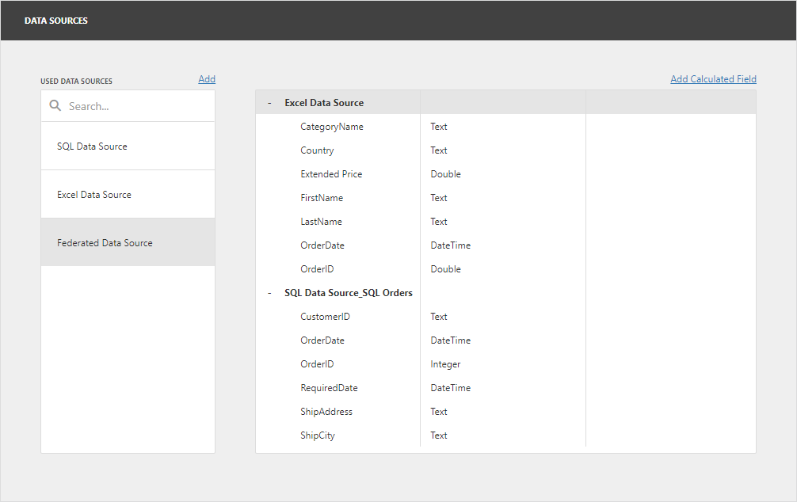
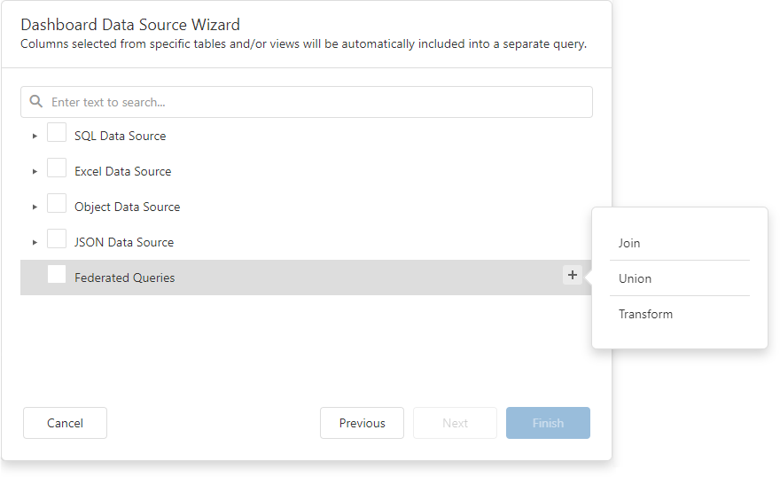

# Specify Data Source Settings (Data Federation)

The wizard appears if you select **Data Federation** on the start page. On this wizard page, you can create federated queries based on data from other data sources.

## Include Data into Separate Queries
Enable check boxes for data fields, queries, and entire data sources.

The selected items are included in data federation as separate queries.

The wizard specifies query names as follows:

- If the initial data source contains one or more queries (for example, SQL data sources), the federated query name consists of the data source name and query name separated by an underscore: `SQL Data Source_SQL Orders`.
- If the initial data source contains data at the root level (for example, Excel data sources), the federated query name is equal to the data source name: `Excel Data Source`.

## Combine Data into a Single Query

To combine data from multiple data sources into a single query, hover over the Federated Query string. Click **Add query** (the `+` sign) and select one of the query types:

This invokes the Query Builder for federated data sources. See the following section for details: [Query Builder for Federation Data Sources](../query-builder.md#query-builder-for-federated-data-sources).

## Add a New Query to the Existing Federated Data Source

You can add a new query to the existing federated data source. Open the [dashboard menu](../../dashboard-menu.md) and go to the **Data Sources** page. Select the federated data source and click **Manage Queries**:

The **Manage Queries** dialog appears. Click **Add query** and select one of the query types:

This invokes the Query Builder for federated data sources. See the following section for details: [Query Builder for Federation Data Sources](../query-builder.md#query-builder-for-federated-data-sources).