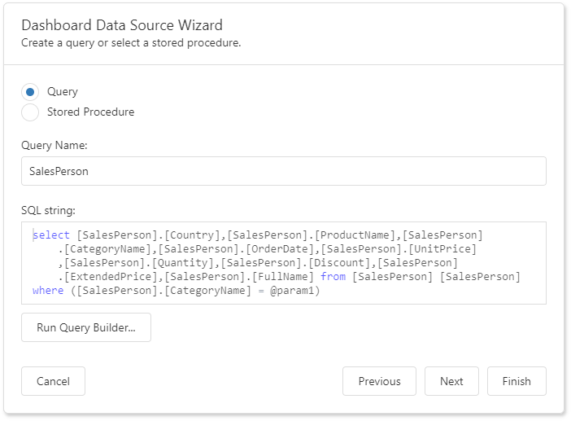
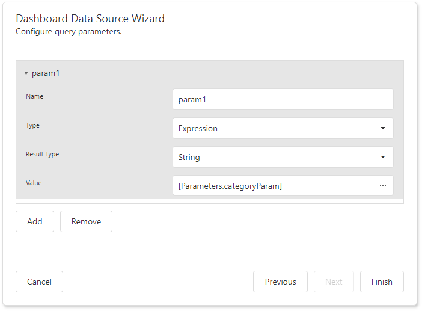

# Specify Data Source Settings (Database)

The following pages are available for the Database source type:

## Select a Data Connection

The "Choose a data connection" page appears if you select Database on the start page. Select an existing connection from the list.

## Choose Queries
The next page allows you to create/edit a query or select a stored procedure. The image below shows a generated query displayed in the **SQL string** editor.

 

 Click **Run Query Builder**... to launch the [Query Builder](../query-builder.md) and choose the tables/columns visually.

 ## Configure Query Parameters
 If the SQL query contains [query parameters](../../../provide-data/working-with-sql-data-sources/pass-query-parameters.md), click **Next** to configure them.

You can use the following techniques to specify a parameter value:

* **Assign a static value** 

  Select a query parameter's type from the **Type** drop-down list and specify a value based on the selected type.

* **Provide a dynamic parameter value**

  Set the **Type** option to **Expression** and specify the **Result Type**. Click the **Value** option's ellipsis button and construct an expression in the invoked Expression Editor.

Click **Finish** to create a new data source.

