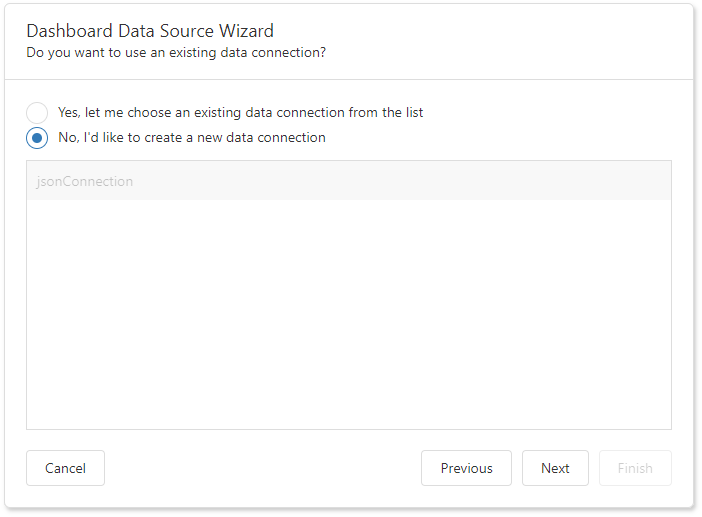
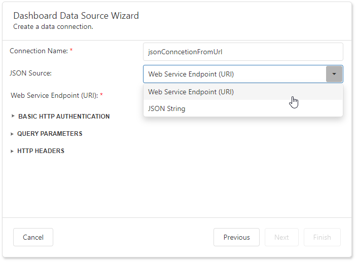
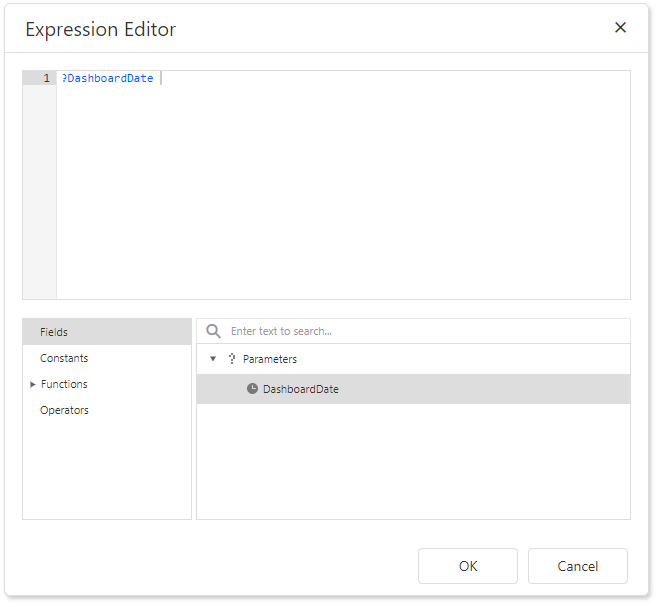
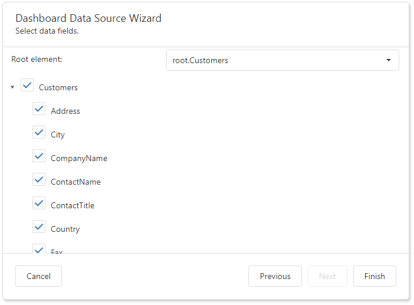

# Specify Data Source Settings (JSON)

## Select an Existing Data Connection

The following page appears if you select JSON on the start page. Select an existing connection from the list. 

Click **Next** to proceed to the [Select Data Fields](#select-data-fields) page.

## Create a New Data Connection

Select a new data connection on the following page and click **Next**.

## Configure a New Data Connection

On the next page, configure a new data connection:

Specify the connection name and select the JSON source type.

### Web Service Endpoint (URI)

A URL to a file in JSON format. You can also specify the Web Service Endpoint's request parameters (username and password, HTTP headers, or query parameters).

- A **path parameter** appends a path element to a JSON endpoint's Uri.
- A **query parameter** specifies an HTTP request parameter that is passed to a JSON endpoint.
- A **header** is a custom HTTP header in JSON endpoint requests.

You can use expressions to specify path parameters, query parameter values, and headers.

Click the **F** icon to switch the **Value** option to **Expression Editor** and click the ellipsis button (**...**)  to invoke the editor.

Double-click the expression in the invoked Expression Editor and click **OK**.

An expression can include [dashboard parameters](../../../data-analysis/dashboard-parameters.md). 

> [!Tip]
> Refer to the following help topic for details on how to create a dashboard parameter: [Creating Parameters](../../../data-analysis/dashboard-parameters/creating-parameters.md). 

Select the **Fields** section in the Expression Editor, double-click the predefined dashboard parameter, and click **OK**.

Path parameters and query parameters are included in endpoint requests in the order in which they are listed. Move a parameter up or down the list to change its position within an endpoint request.

The read-only **Resulting URI** field displays the result: a JSON URI.

Configure basic HTTP authentication credentials and click **Next** to proceed to the [Select Data Fields](#select-data-fields) page. 

### JSON String 

 A string that contains JSON data. You can also use the **Upload JSON** button to load content from the selected JSON file.

Click **Next** to proceed to the "[Select Data Fields](#select-data-fields)" page.

## Select Data Fields

The "Select data fields" page allows you to include / exclude data fields used in a JSON data source.

 

 Click **Finish** to create a JSON data source.
