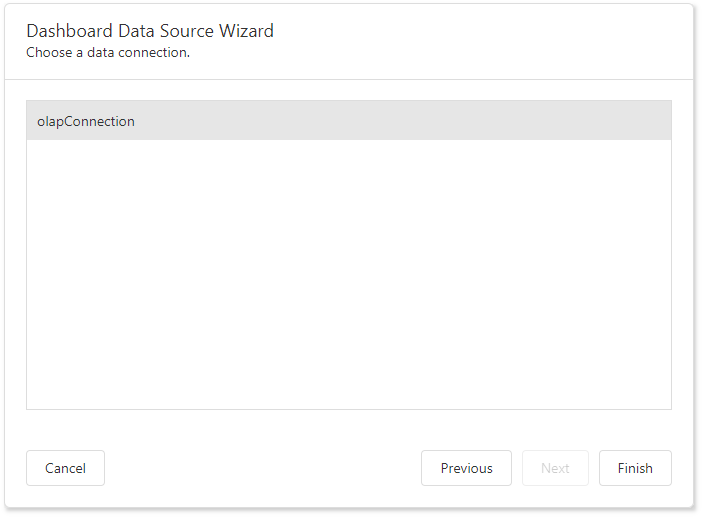

# Specify Data Source Settings (OLAP)

The following page is available for the OLAP data source type: 

## Select a Data Connection
The "Choose a data connection" page appears if you select OLAP on the start page. Select an existing connection from the list.

Click **Finish** to create an OLAP data source.