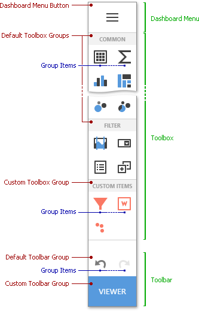

# Toolbox
The **Toolbox** provides access to the dashboard menu, and allows you to add dashboard items, as well as undo or repeat user actions.

The main parts of the Toolbox are listed below.

* **Dashboard Menu** - contains the dashboard menu elements. They allow you to save or load dashboards and configure general dashboard settings. To invoke this menu, click on the [Dashboard Menu](dashboard-menu.md) button.
* **Toolbox** - contains buttons that allow you to add dashboard items like [Grid](../dashboard-item-settings/grid.md), [Maps](../dashboard-item-settings/geo-point-maps.md), [Treemap](../dashboard-item-settings/treemap.md), [Filter Elements Overview](../dashboard-item-settings/filter-elements/filter-elements-overview.md) or custom items.
* **Toolbar** - the bottom part of the Toolbox that contains undo/redo buttons and buttons with custom functionality.

## Toolbox Groups

The Toolbox groups dashboard items as follows:

- **Common** - Data items used to visualize data.
    - [Grid](..\dashboard-item-settings\grid.md)
    - [Pivot](..\dashboard-item-settings\pivot.md)
    - [Chart](..\dashboard-item-settings\chart.md)
    - [Treemap](..\dashboard-item-settings\treemap.md)
    - [Pies](..\dashboard-item-settings\pies.md)
    - [Scatter Chart](..\dashboard-item-settings\scatter-chart.md)
    - [Cards](..\dashboard-item-settings\cards.md)
    - [Gauges](..\dashboard-item-settings\gauges.md)
    - [Text Box](..\dashboard-item-settings\text-box.md)
    - [Image](..\dashboard-item-settings\images\image-overview.md)
    - [Bound Image](..\dashboard-item-settings\images\image-overview.md)

- **Maps** - Map dashboard items.
    - [Choropleth Map](..\dashboard-item-settings\choropleth-map.md)
    - [Geo Point Map](..\dashboard-item-settings\geo-point-maps\geo-point-map.md)
    - [Bubble Map](..\dashboard-item-settings\geo-point-maps\bubble-map.md)
    - [Pie Map](..\dashboard-item-settings\geo-point-maps\pie-map.md)

- **Filter** - Items used to filter data in data items.
    - [Range Filter](..\dashboard-item-settings\range-filter.md)
    - [Combo Box](..\dashboard-item-settings\filter-elements\filter-elements-overview.md)
    - [List Box](..\dashboard-item-settings\filter-elements\filter-elements-overview.md)
    - [Tree View](..\dashboard-item-settings\filter-elements\filter-elements-overview.md)
    - [Date Filter](..\dashboard-item-settings\date-filter.md)

- **Layout** - Items used to arrange another dashboard items in a dashboard.
    - [Group](..\dashboard-item-settings\dashboard-item-group.md)
    - [Tab Container](..\dashboard-item-settings\tab-container.md)