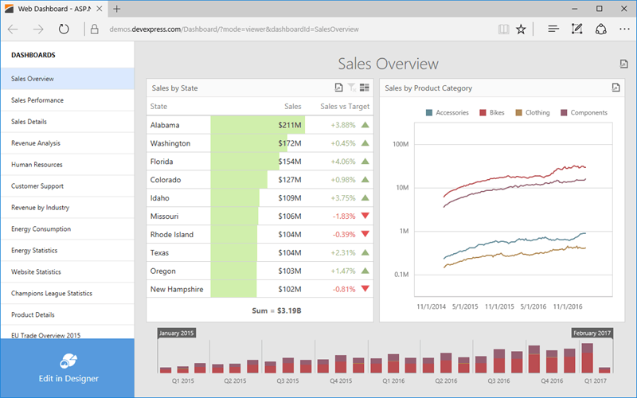

# Web Dashboard - Viewer Mode
The **Web Dashboard** provides the capability to display dashboards in web browsers on desktop and mobile devices.

## Data Presentation
The topics in this section provide information on how the Web Dashboard presents data.
* [Data Presentation Basics ](web-dashboard-viewer-mode/data-presentation/data-presentation-basics.md)
* [Master Filtering](web-dashboard-viewer-mode/data-presentation/master-filtering.md)
* [Drill-Down](web-dashboard-viewer-mode/data-presentation/drill-down.md)
* [Dashboard Layout](web-dashboard-viewer-mode/data-presentation/dashboard-layout.md)

## Dashboard Parameters
The following topic describes how to change dashboard parameter values.
* [Requesting Parameter Values](web-dashboard-viewer-mode/dashboard-parameters/requesting-parameter-values.md)

## Exporting
The Web Dashboard provides the capability to export individual items of a dashboard, as well as the entire dashboard.
* [Exporting](web-dashboard-viewer-mode/exporting.md)

## Dashboard Items
Dashboard items are used to present information in various ways.
* [Chart](web-dashboard-viewer-mode/dashboard-items/chart.md)
* [Scatter Chart](web-dashboard-viewer-mode/dashboard-items/scatter-chart.md)
* [Grid](web-dashboard-viewer-mode/dashboard-items/grid.md)
* [Pies](web-dashboard-viewer-mode/dashboard-items/pies.md)
* [Cards](web-dashboard-viewer-mode/dashboard-items/cards.md)
* [Gauges](web-dashboard-viewer-mode/dashboard-items/gauges.md)
* [Pivot](web-dashboard-viewer-mode/dashboard-items/pivot.md)
* [Choropleth Map](web-dashboard-viewer-mode/dashboard-items/choropleth-map.md)
* [Geo Point Maps](web-dashboard-viewer-mode/dashboard-items/geo-point-maps.md)
* [Range Filter](web-dashboard-viewer-mode/dashboard-items/range-filter.md)
* [Image](web-dashboard-viewer-mode/dashboard-items/image.md)
* [Text Box](web-dashboard-viewer-mode/dashboard-items/text-box.md)
* [Treemap](web-dashboard-viewer-mode/dashboard-items/treemap.md)
* [Filter Elements](web-dashboard-viewer-mode/dashboard-items/filter-elements.md)