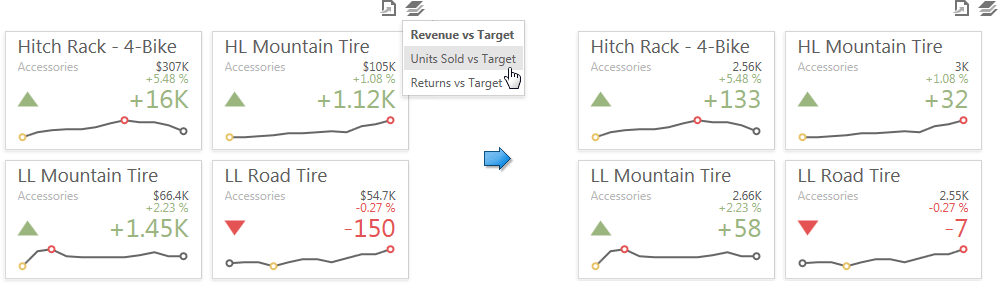
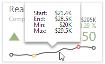

# Data Presentation Basics
The **Card** dashboard item displays a series of cards. Each card illustrates the difference between two values. This difference can be expressed as an absolute value, an absolute variation or a percentage variation.

The **Card** dashboard item can illustrate this difference for various sets of values. You can switch between these sets using the **Values** button (the  icon) in the card's [caption](../../data-presentation/dashboard-layout.md).

## Tooltip
A **Card** dashboard item can display a tooltip for cards containing a sparkline. When the mouse pointer is hovered over the sparkline, the tooltip can display start/end values and minimum/maximum values.

