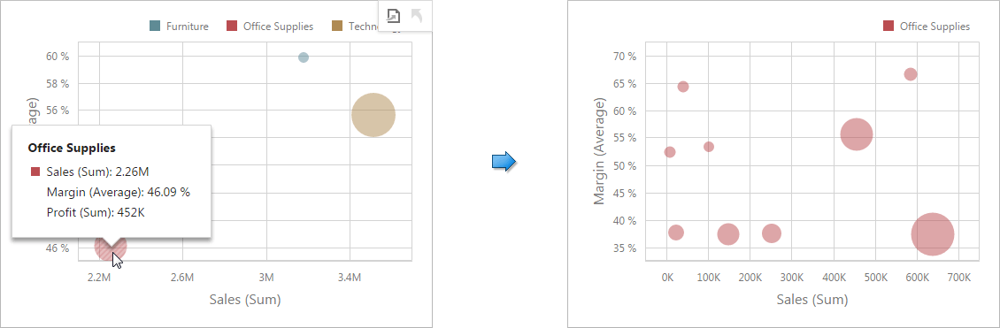

This topic describes features that enable interaction between the **Scatter Chart** and other dashboard items. These features include **Master Filtering** and **Drill-Down**.

## Master Filtering
The Web Dashboard allows you to use any data aware dashboard item as a filter for other dashboard items (**Master Filter**). To learn more about filtering concepts common to all dashboard items, see the [Master Filtering](../../../../../dashboard-for-web/articles/web-dashboard-viewer-mode/data-presentation/master-filtering.md) topic.

When Master Filtering is enabled, you can click a point (or multiple points) to make other dashboard items only display data related to the selected point(s).

To reset filtering, use the **Clear Master Filter** button (the  icon) in the Chart's [caption](../../../../../dashboard-for-web/articles/web-dashboard-viewer-mode/data-presentation/dashboard-layout.md) area, or the **Clear Master Filter** command in the Chart's context menu.

## Drill-Down
The built-in drill-down capability allows you to change the detail level of data displayed in dashboard items on the fly. To learn more, see [Drill-Down](../../../../../dashboard-for-web/articles/web-dashboard-viewer-mode/data-presentation/drill-down.md).

When drill-down is enabled, you can click a point to view the details.

> When **Master Filtering** is enabled, you can view the details by clicking a selected point.

To return to the previous detail level (drill up), use the **Drill Up** button (the  icon) within the Chart's [caption](../../../../../dashboard-for-web/articles/web-dashboard-viewer-mode/data-presentation/dashboard-layout.md) area, or the **Drill Up** command in the Chart's context menu.