# Coloring 

The Dashboard Designer associates dimension values/measures and specified colors to paint dashboard item elements. This topic describes how to configure color settings in the WinForms Designer.

## Coloring Basics

The following concepts are common to both Desktop and Web Dashboard controls:

* Dashboard palettes
* Color Modes
* Color Schemes
* Supported Dashboard Items

Refer to the following topic for more information about common concepts: [Coloring Basics](../coloring.md).

## Predefined Dashboard Palettes

The following palettes are available:

| Palette | Description |
| --- | --- |
| **Default** | The default palette used to color dashboard item elements. |
| **Bright** | Bright color accents. Optimized for users with deuteranopia and protanopia. |
| **High Contrast** | High visual contrast. Suitable for grayscale rendering, monochrome vision, and users with deuteranopia, protanopia, and tritanopia. |
| **Warm Gradient** | A Yellow-Orange-Brown palette. Optimized for grayscale rendering and users with deuteranopia, protanopia, and tritanopia. |
| **Sunset** | Warm sunset tones intended for values between two extremes. Optimized for users with deuteranopia and protanopia. |
| **Vibrant** | Vivid color contrast. Optimized for users with deuteranopia and protanopia. |

You can change a dashboard palette in the Color Scheme dialog in the WinForms Dashboard Designer:

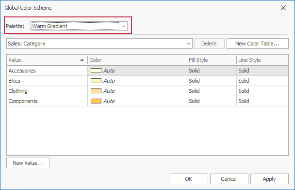

The selected palette applies to the entire dashboard and uses consistent colors and styles for identical values across dashboard items.

### Hatch and Line Styles

For each color, you can also specify hatch and line styles to distinguish data series without relying on color:

* **Line Styles** 
    
    Use line styles for Chart and Range Filter dashboard items with line series.

    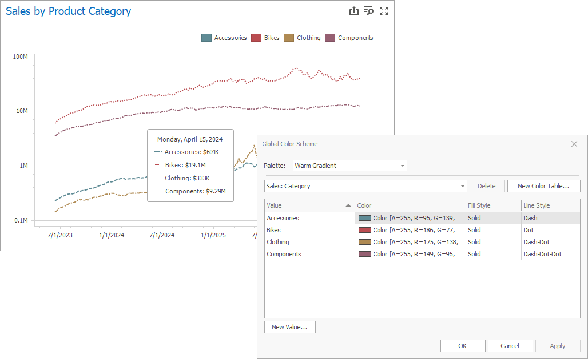

* **Fill Styles** 
    
    Use a solid or hatch fill style for Chart dashboard items with bar and bubble series, Range Filter dashboard items with bar series, Pie, Scatter Chart, and Pie Map dashboard items.

    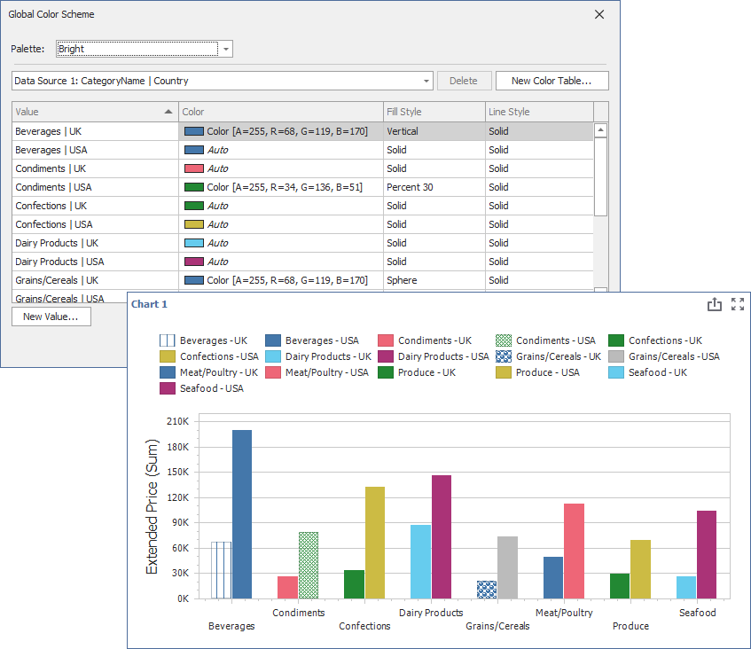

> [!NOTE]
> Hatch and line styles apply only to the dashboard items and series types listed above.

## Color Mode: None 

You can disable default color variation for dashboard item elements.  

If you add a [TreeMap](../../dashboard-item-settings/treemap.md) to a dashboard, individual elements (titles) use different colors: 

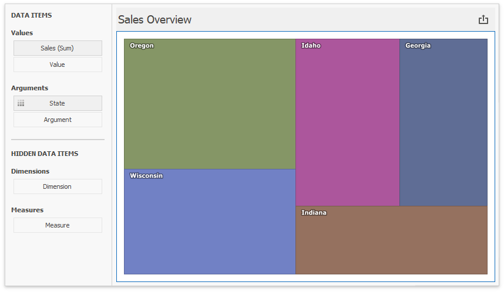

_State_ values (Arguments) use different colors. To disable color variation, go to the Argument settings and select **Color by | None**.

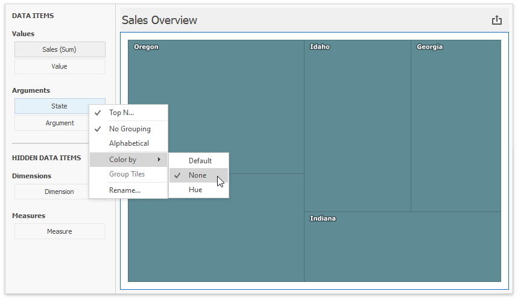

Add a [Chart](../../dashboard-item-settings/chart.md) with the same Argument and Value as in the TreeMap: 

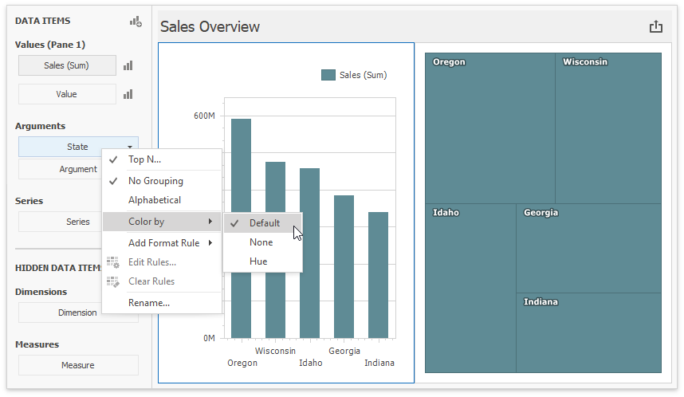

Note that **Default** means **None** for chart arguments.  

## Color Mode: Hue 

You can enable colors in previously added Treemap and Chart items.

Set the TreeMap's color mode to **Default** or **Hue**: 

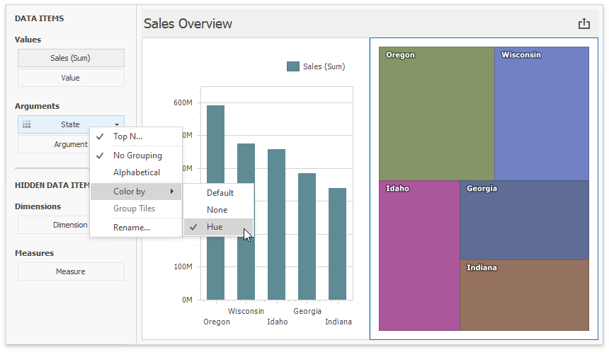

In the Chart settings, move _State_ from Arguments to Series. **Default** now means **Hue** in this new context. The coloring indicator (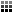) on the data item shows that color variation by hue is enabled.

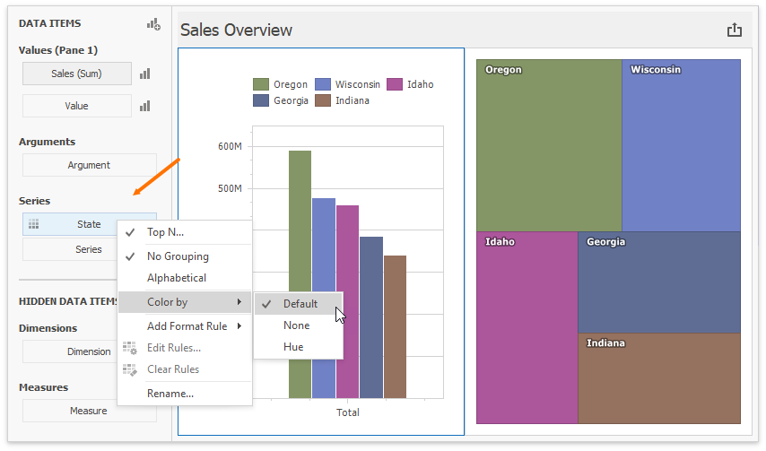

Add _Category_ as a chart argument and switch to 100% Stacked View:  

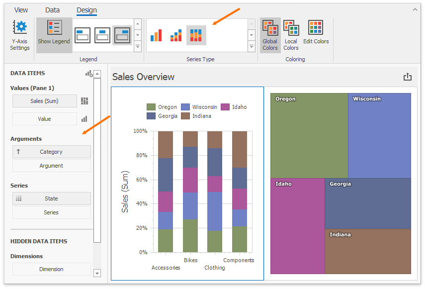

## Use Global Color Scheme 

The same _State_ data items use identical colors and styles. The dashboard constructs a **Global Color Scheme** for this purpose. 

Add a [Range Filter](../../dashboard-item-settings/range-filter.md) with the following settings: 

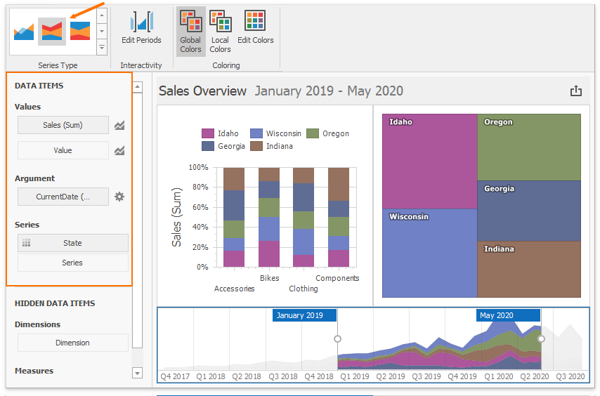

Identical colors and styles correspond to the same _State_ values, so you can associate and compare data across all dashboard items. All items use **Global Colors** by default (you can toggle this in the Ribbon). Click **Edit Colors** to modify the colors and styles used in the palette:

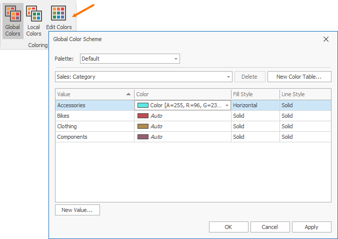

This is how the Dashboard appears after you change the color or style for *Georgia* in the palette:

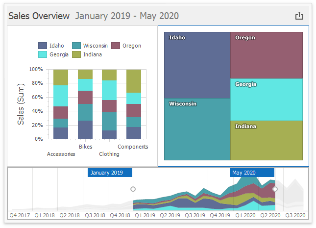

## Use Local Color Scheme 

If you want to use an independent set of colors and styles in the selected dashboard item, switch to the **Local Color Scheme**. 

You can see the Treemap's arguments that use colors from the **Local Color Scheme**:  

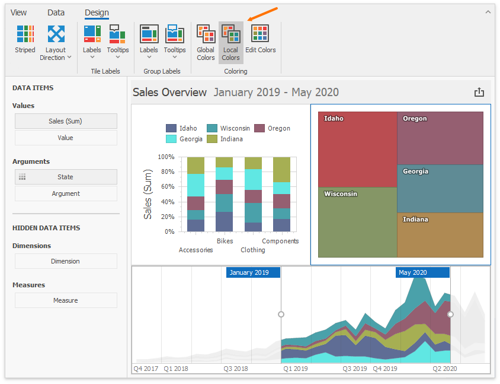

Colors modified in the local color scheme do not affect items that use the global color scheme. The following image shows a custom color for _Georgia_ in the Treemap:

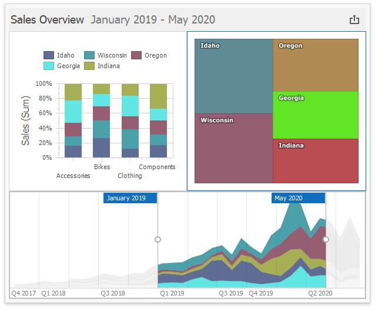

## Dashboard Item Color Mode Specifics

* [Chart - Coloring](../../dashboard-item-settings/chart/coloring.md)
* [Scatter Chart - Coloring](../../dashboard-item-settings/scatter-chart/coloring.md)
* [Pie - Coloring](../../dashboard-item-settings/pies/coloring.md)
* [Pie Map - Coloring](../../dashboard-item-settings/geo-point-maps/pie-map/coloring.md)
* [Range Filter - Coloring](../../dashboard-item-settings/range-filter/coloring.md)
* [Treemap - Coloring](../../dashboard-item-settings/treemap/coloring.md)

## How to Customize a Color Scheme

Refer to the following topic for more information on how to customize a color scheme:
* [Customizing a Color Scheme](customizing-a-color-scheme.md)
