# Customizing a Color Scheme

The Dashboard Designer allows you to edit colors and styles in [global and local color schemes](coloring-concepts.md). You can select a color or style from a dashboard palette or specify a custom color or style.
* [Invoke a Color Scheme Dialog](#invoke-a-color-scheme-dialog)
* [Edit Colors](#edit-colors)
* [Add a New Value](#add-a-new-value)
* [Add a New Color Table](#add-a-new-color-table)

## Invoke a Color Scheme Dialog
To edit colors and styles, use the **Color Scheme** dialog. You can open this dialog in the following ways:

* To edit colors and styles in a global color scheme, use the **Edit Colors** button in the **Home** ribbon tab or the **Edit Colors** button in the dashboard item's **Design** tab.
	
	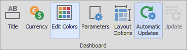  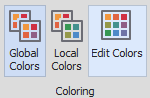
* To edit colors and styles in a local color scheme, use the **Edit Colors** button in the contextual **Design** ribbon tab.
	
	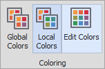

Consider a Chart dashboard item where dimensions and measures are colored by hue with local colors.

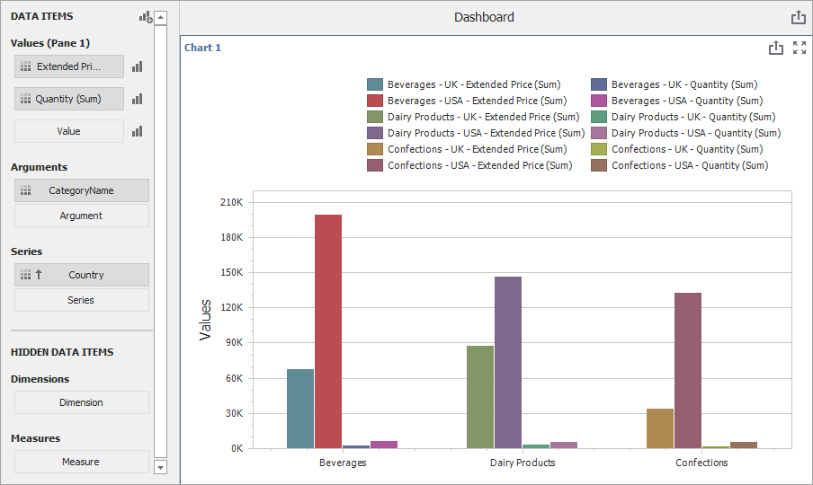

For this dashboard item, the **Color Scheme** dialog will contain combinations of all dimension values and a specific measure.

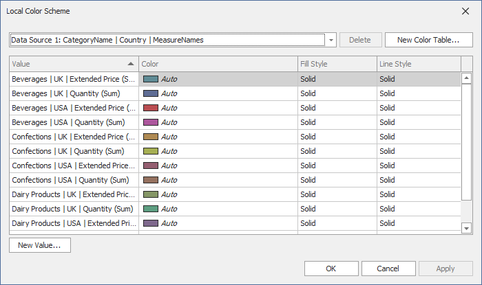

In this dialog, you can perform the following actions.
* [Edit automatically assigned colors and styles](#edit-colors) or specify new colors and styles.
* [Add new values](#add-a-new-value) to a color table.
* [Add new color tables](#add-a-new-color-table) that contain values whose colors and styles are not yet assigned.

## Edit Colors
You can customize automatically assigned colors and styles in several ways.
* To retain the automatically assigned color for the selected value, right-click the required value in the **Value** column and select **Retain this color**.
	
	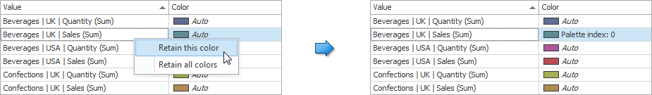
	
	This reserves the current palette color for the selected value.
* You can click the required cell in the **Color** column to select another palette color.
	
	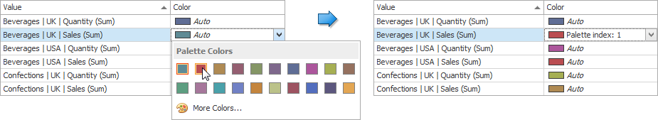
* To specify a custom color, click **More Colors...** and use the RGB or HSB color model in the invoked **Select Color** dialog to choose any color.
	
	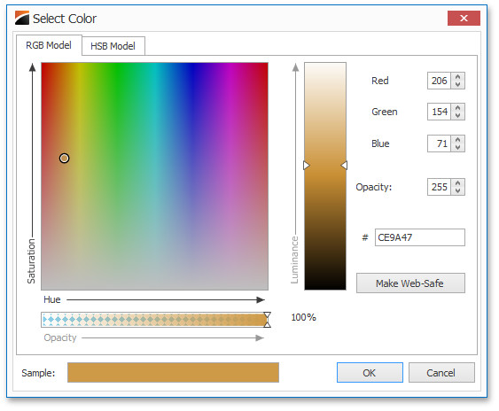

* To specify a fill style, click the required cell in the **Fill Style** column and select the required hatch style from the drop-down list.
	
	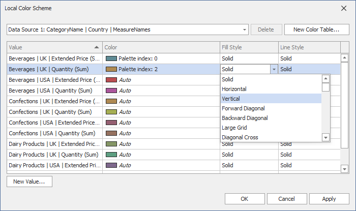

* To specify a line style, click the cell in the **Line Style** column and select the line style from the drop-down list.

	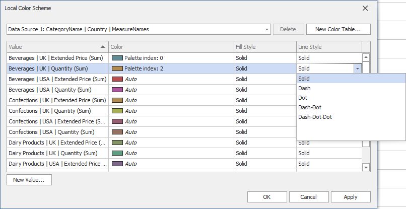

Use the **Reset**/**Reset all** menu items to reset the customized colors.

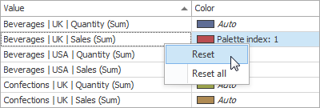

## Add a New Value
The **Color Scheme** dialog allows you to add a new value with the specified color to the selected color table. To do this, click the **New Value...** button.

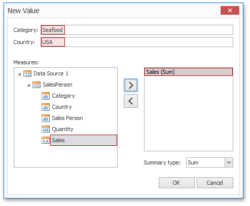

In the invoked **New Value** dialog, specify the dimension values, add the required measures and click **OK**. This creates a new value whose color can be specified as described in [Edit Colors](#edit-colors).

You can remove manually added values using the **Remove** context menu item.

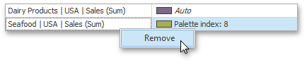

## Add a New Color Table

The **Color Scheme** dialog also allows you to add a new color table containing values whose colors are not yet assigned. To do this, click the **New Color Table...** button.

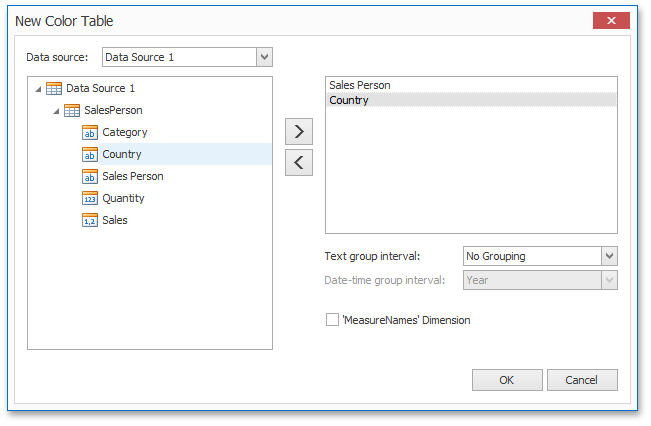

In the invoked dialog, specify the data source, add the required dimensions and enable the **'MeasureNames' Dimension** check-box if you need to add measures to a color table.

Click **OK** to add the color table to a color scheme. Then, you can add values to this table (see [Add a New Value](#add-a-new-value)) and specify its colors (see [Edit Colors](#edit-colors)).