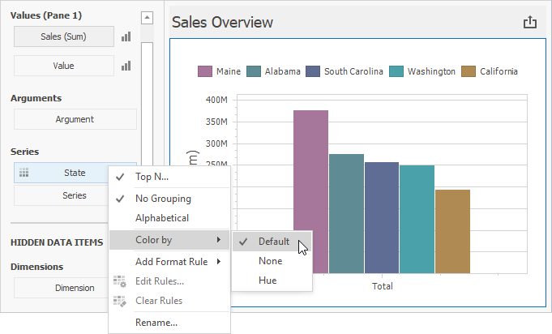

# Coloring

The Chart dashboard item paints different measures and series dimensions by [hue](../../appearance-customization/coloring/coloring-concepts.md) in **Default** color mode. The image below shows the chart item where _State_ series dimension values are painted in different colors. A special icon () on the data item shows that color variation is enabled.

For each color, you can also specify fill and line styles to distinguish data series without relying on color:

* **Line Styles** 
    Use line styles for Chart dashboard items with line series.

    

* **Fill Styles** 
Use a solid or hatch fill style for Chart dashboard items with bar and bubble series.

    

> [!NOTE]
> The Chart dashboard item does not support color variation for the [financial](series/financial-series.md) series.

>[!Tip]
>**Documentation:** 
>* [Conditional Formatting](conditional-formatting.md)
>* [Coloring Basics](../../appearance-customization/coloring.md)
