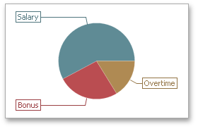
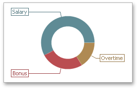
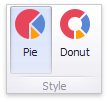
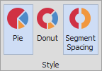

# Style

The **Pie** dashboard item allows you to select whether diagrams should be painted as **pies** or **donuts**.

To select the diagram style, use the **Pie** and **Donut** buttons in the **Style** section of the **Design** Ribbon tab.

## Segment Spacing

You can enable the **Segment Spacing** button in the **Style** section of the **Design** Ribbon tab to increase spacing between item elements:

