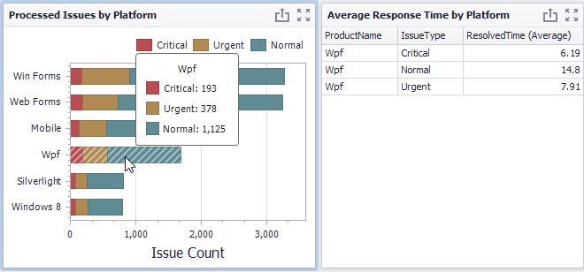
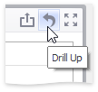

# Interactivity
This topic describes features that enable interaction between the **Chart** and other dashboard items. These features include **Master Filtering** and **Drill-Down**.

## Master Filtering
The **Dashboard** allows you to use any data aware dashboard item as a filter for other dashboard items (**Master Filter**). To learn more about filtering concepts common to all dashboard items, see the [Master Filtering](../../data-presentation/master-filtering.md) topic.

The Chart dashboard item supports filtering by **argument** or **series** values.
* **Filtering by Arguments**
	
	When filtering by arguments is enabled, you can click series points to make other dashboard items display only data related to selected argument values.
	
	
* **Filtering by Series**
	
	When filtering by series is enabled, you can click a series point to make other dashboard items display only data related to the selected series.
	
	
* **Filtering by Points**
	
	When filtering by points is enabled, you can click a individual point to make other dashboard items display only data related to the selected point.
	
	

To reset filtering, use the **Clear Master Filter** button in the Chart's [caption](../../data-presentation/dashboard-layout.md), or corresponding command in the Chart's context menu.

## Drill-Down
The built-in drill-down capability allows you to change the detail level of data displayed in dashboard items on the fly. To learn more, see [Drill-Down](../../data-presentation/drill-down.md).

The Chart dashboard item supports drill-down on argument or series values.
* **Drill Down on Arguments**
	
	When drill-down on arguments is enabled, you can click a series point to view a detail chart for the corresponding argument value.
	
	
	
	> [!NOTE]
	> When **Filtering by Arguments** is enabled, you can view the details by double-clicking a series point.
* **Drill-Down on a Series**
	
	When drill-down on a series is enabled, you can click a series point (or corresponding legend item) to view a detail chart for the corresponding series.
	
	
	
	> [!NOTE]
	> When **Filtering by Series** is enabled, you can view the details by double-clicking a series point.

To return to the previous detail level (drill up), use the **Drill Up** button within the Chart [caption](../../data-presentation/dashboard-layout.md) area, or the corresponding command in the Chart's context menu.

