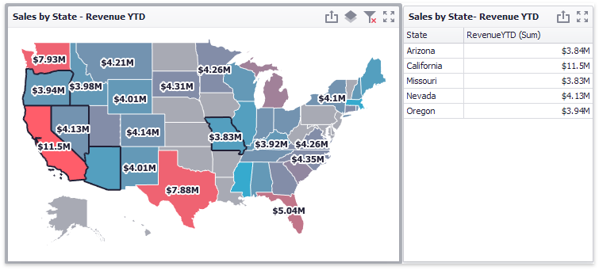

---
title: Interactivity
author: Natalia Kazakova
legacyId: 16680
---
# Interactivity
This document describes the features that enable interaction between the **Choropleth Map** and other dashboard items. These features include **Master Filtering**.

## Master Filtering
The **Dashboard** allows you to use any data aware dashboard item as a filter for other dashboard items (**Master Filter**). To learn more about filtering concepts common to all dashboard items, see the [Master Filtering](../../data-presentation/master-filtering.md) topic.

When Master Filtering is enabled, you can click a shape (or multiple shapes by holding down the **CTRL** key) to make other dashboard items only display data related to the selected shape(s).

You can also select multiple shapes in the following way.
* Hold the **SHIFT** key and the left mouse button;
* Drag the mouse pointer to mark an area that includes the desired shapes;
* Release the left mouse button. All shapes within the area will be selected.

To reset filtering, use the **Clear Master Filter** button (the  icon) in the Map's [caption](../../data-presentation/dashboard-layout.md), or the **Clear Master Filter** command in the context menu.