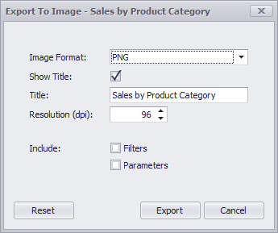

# Printing and Exporting
**Dashboard** allows you to print/export individual dashboard items, or the entire dashboard. To learn more about printing concepts common to all dashboard items, see the [Printing and Exporting](../../printing-and-exporting.md) topic.

This topic describes the specifics of printing/exporting a **Gauge** dashboard item.
* [Printing](#printing)
* [Export To PDF](#export-to-pdf)
* [Export To Image](#export-to-image)
* [Export To Excel](#export-to-excel)

## <a name="printing"/>Printing
If you are printing a Gauge dashboard item using the [Print Preview](../../../dashboard-designer/ui-elements/print-preview.md), you can customize the following options (via the **Options** button) before printing.

* **Show Title** - Specifies whether or not to apply the dashboard item caption to the printed document title.
* **Title** - Specifies the title of the printed document.
* **Auto Arrange Content** - Specifies whether or not gauges are arranged automatically on the printed document.
* **Include | Filters** - Allows you to include master filter values to the printed document.
* **Include | Parameters** - Allows you to include parameter values to the printed document.
* **Position** - Specifies the position of the master filter and parameter values in the printed document. You can select between _Below_ and _Separate Page_.

Specify the required options in the **Options** dialog and click the **Submit** button to apply the changes. To reset changes to the default values, click the **Reset** button.

## <a name="export-to-pdf"/>Export To PDF

* **Page Layout** - Specifies the page orientation used to export a dashboard item.
* **Size** - Specifies the standard paper size.
* **Show Title** - Specifies whether or not to apply the Gauge caption to the exported document title.
* **Title** - Specifies the title of the exported document.
* **Auto Arrange Content** - Specifies whether or not gauges are arranged automatically in the exported document.
* **Scale Mode** - Specifies the mode for scaling when exporting a dashboard item.
* **Scale Factor** - Specifies the scale factor (in fractions of 1) by which a dashboard item is scaled.
* **Auto Fit Page Count** - Specifies the number of horizontal/vertical pages spanning the total width/height of a dashboard item.
* **Include | Filters** - Allows you to include master filter values to the exported document.
* **Include | Parameters** - Allows you to include parameter values to the exported document.
* **Position** - Specifies the position of the master filter and parameter values in the exported document. You can select between _Below_ and _Separate Page_.

Specify the required options in this dialog and click the **Export** button to export the Gauge dashboard item. To reset changes to the default values, click the **Reset** button.

## <a name="export-to-image"/>Export To Image
All data-bound dashboard items provide the same set of options when exporting them to an Image format. The following options are available:

* **Show Title** - Specifies whether to apply the dashboard item caption to the exported document title.
* **Title** - Specifies of the exported document's title.
* **Image Format** - Specifies the image format in which the dashboard item is exported.
* **Resolution (dpi)** - Specifies the resolution (in dpi) used to export the dashboard item.
* **Include | Filters** - Allows you to include master filter values to the exported document.
* **Include | Parameters** - Allows you to include parameter values to the exported document.
* **Position** - Specifies the master filter and parameter values' position in the exported document. You can select between _Below_ and _Separate Page_.

Specify the required options in this dialog and click the **Export** button to export the dashboard item. Click the **Reset** button to reset changes to the default values.

## <a name="export-to-excel"/>Export To Excel
Data visualized within all data-bound dashboard items can be exported to the required Excel format. The following options are available:

* **Excel Format** - Specifies the Excel format in which the dashboard item is exported. You can use the XLSX, XLS or CSV formats.
* **Separator** - Specifies the string used to separate values in the exported CSV document.
* **Include | Filters** - Allows you to include master filter values to the exported document.
* **Include | Parameters** - Allows you to include parameter values to the exported document.
* **Position** - Specifies the master filter and parameter values' position in the exported document. You can select from _Below_ and _Separate Sheet_.

Specify the required options in this dialog and click the **Export** button to export the dashboard item. Click the **Reset** button to reset changes to the default values.