# Coloring

The Web Dashboard provides the capability to manage the coloring of dashboard item elements, such as chart series points or pie segments.

## Supported Dashboard Items
You can manage coloring for the following dashboard items.
* [Chart](../dashboard-item-settings/chart.md)
* [Scatter Chart](../dashboard-item-settings/scatter-chart.md)
* [Pie](../dashboard-item-settings/pies.md)
* [Pie Map](../dashboard-item-settings/geo-point-maps/pie-map.md)
* [Range Filter](../dashboard-item-settings/range-filter.md)
* [Treemap](../dashboard-item-settings/treemap.md)

## Color Schemes Overview
The dashboard supports two ways to color dashboard item elements:

* **Global color scheme**. This scheme uses consistent colors and styles for identical values across the dashboard. The image below shows a dashboard that contains Pie and Chart dashboard items. Pie segments and chart series points that correspond to Wisconsin, Oregon and Idaho dimension values use identical colors from the default palette.

    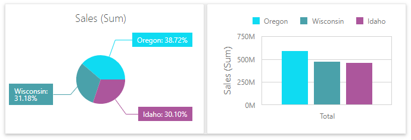

    For a global color scheme, the dashboard reserves automatically generated colors for specific values regardless of the filter state.

* **Local color scheme**. This scheme uses an independent set of colors and styles for each dashboard item. The image below shows Pie segments that use colors from a local color scheme. These colors do not affect the Chart item that uses a global scheme.

    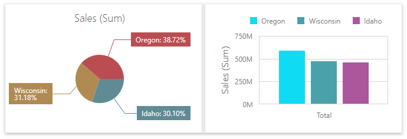

    For a Local color scheme, the dashboard reassigns palette colors when the filter state is changed.

## Color Measures and Dimensions

You can configure color modes as follows:

- A specific data item - To specify color mode for a specific measure/dimension, open the [data item menu](../ui-elements/data-item-menu.md) and go to the **Data Shaping** section. Use the **Coloring** option to specify the color mode of this data item.
	
	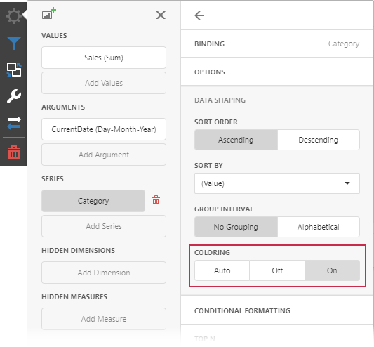
- All data items - To see a list of all measures/dimensions for which you can specify color mode in a dashboard item, open the dashboard item's [Options](../ui-elements/dashboard-item-menu.md) menu and go to the **Coloring** section. 
	
	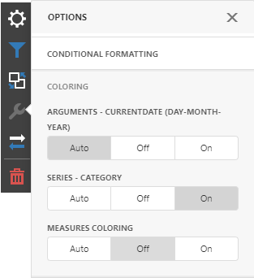

For example, the image below shows the Chart dashboard item whose _Country_ **dimension** is colored by different hues:

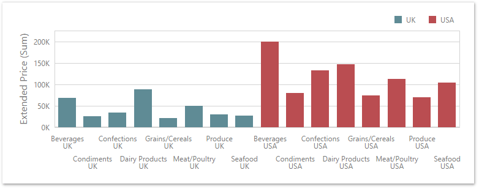

And the following Pie dashboard item colors **measures** by different hues:

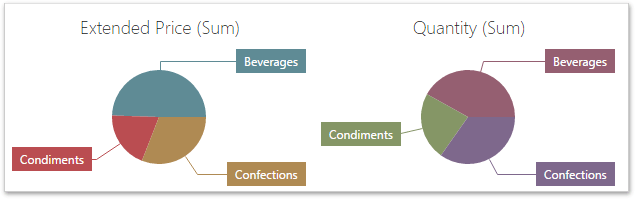

> [!NOTE]
> If you color multiple dimensions or measures by hue, each combination of values gets a different color from the palette.

## Dashboard Item Color Mode Specifics

The following table describes how colors are applied based on the dashboard item's type.

| Item's Name | Coloring Specifics |
| -- | -- |
| **Chart** | The Chart colors different measures and series dimensions by hue. |
| **Scatter Chart** |The Scatter Chart does not color its arguments. |
| **Pies** |  If the Pie dashboard item contains measures (the _Values_ section) and series dimensions (the _Series_ section), only values that correspond to different measures are colored by hue.    If the Pie dashboard item contains arguments (the _Arguments_ section), different argument values are colored by hue. |
|**Choropleth Map** | The Choropleth Map automatically selects palette and scale settings to color map shapes. |
|**Bubble Map** | The Bubble Map automatically selects palette and scale settings used to color bubbles depending on the provided values.
| **Pie Map** |  The Pie Map allows you to color segments that correspond to various dimension values/measures. |
| **Range Filter** |  The Range Filter colors different measures and series dimensions by hue. |
| **Treemap** |  If the Treemap contains only measures (the _Values_ section), values that correspond to different measures are colored by different hues.   If the Treemap contains arguments (the _Arguments_ section), values that correspond to the first argument are colored by different hues. |

To change default coloring behavior, [configure color modes](#color-measures-and-dimensions).

## Predefined Dashboard Palettes

The Web Dashboard includes the following palettes:

| Palette | Description |
| --- | --- |
| **Default** | The default palette used to color dashboard item elements. |
| **Bright** | Bright color accents. Optimized for users with deuteranopia and protanopia. |
| **High Contrast** | High visual contrast. Suitable for grayscale rendering, monochrome vision, and users with deuteranopia, protanopia, and tritanopia. |
| **Warm Gradient** | A Yellow-Orange-Brown palette. Optimized for grayscale rendering and users with deuteranopia, protanopia, and tritanopia. |
| **Sunset** | Warm sunset tones intended for values between two extremes. Optimized for users with deuteranopia and protanopia. |
| **Vibrant** | Vivid color contrast. Optimized for users with deuteranopia and protanopia. |

You can change a dashboard palette in the Color Scheme dialog in the Web Dashboard Designer:

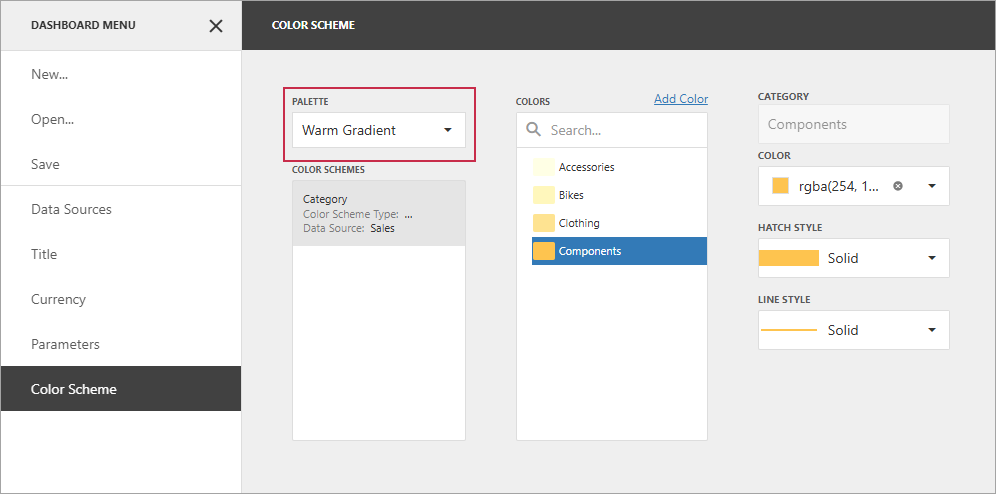

The selected palette applies to the entire dashboard and uses consistent colors and styles for identical values across dashboard items.

### Hatch and Line Styles

For each color, you can also specify hatch patterns and line styles to distinguish data series without relying on color:

* **Line Styles** 

    Use line styles for Chart and Range Filter dashboard items with line series.

    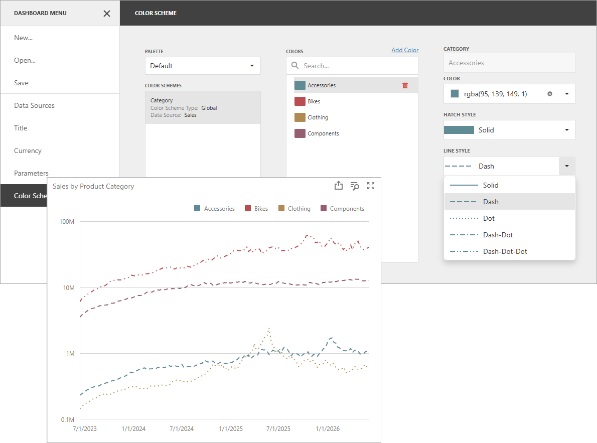

* **Fill Styles** 
    
    Use a solid or hatch fill style for Chart dashboard items with bar and bubble series, Range Filter dashboard items with bar series, Pie, Scatter Chart, and Pie Map dashboard items.

    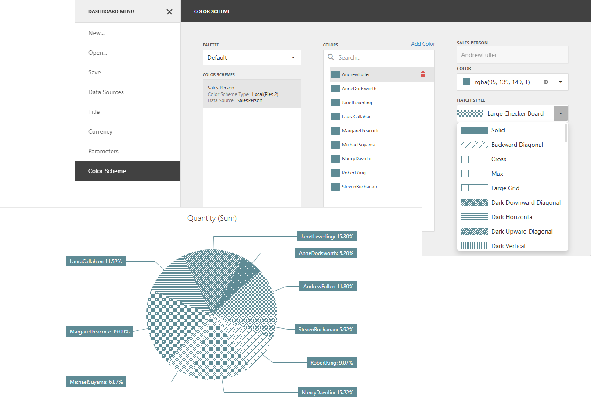

> [!NOTE]
> Hatch and line styles apply only to the dashboard items and series types listed above.

## Conditional Formatting

The DevExpress Dashboard allows you to format [dashboard item](../../web-dashboard-viewer-mode/dashboard-items.md) elements whose values meet a specified condition. This feature highlights specific elements with a predefined set of rules. 

Refer to the following article for more information about conditional formatting: [Conditional Formatting](../appearance-customization/conditional-formatting.md).

## Switch between Global and Local Color Schemes

The dashboard supports two ways to color dashboard item elements:
- A **Global Color Scheme** uses consistent colors and styles for identical values across the dashboard.
- A **Local Color Scheme** uses an independent set of colors and styles for each dashboard item.

To switch between global and local color schemes in the Web Dashboard, open the dashboard item's [**Options**](../ui-elements/dashboard-item-menu.md) menu, go to the **Color Scheme** section, and select the Color Scheme type.

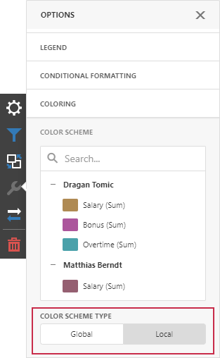

>[!TIP]
> The **local** color scheme paints dashboard item elements more quickly because the control does not request all possible colors and requests only colors used in the current item.

## Customize Color Palettes in the Dashboard Item Menu

Use the **Color Scheme** section of the dashboard item [Options](../ui-elements/dashboard-item-menu.md) menu to customize colors of the specific palette. To edit the color scheme, click the **Edit** button  of the corresponding color.

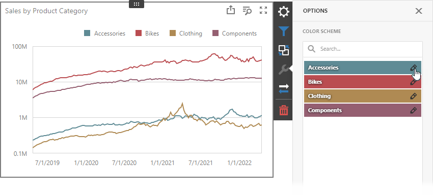

Then pick a color in the color picker and select a fill style and line style from the corresponding drop-down lists:

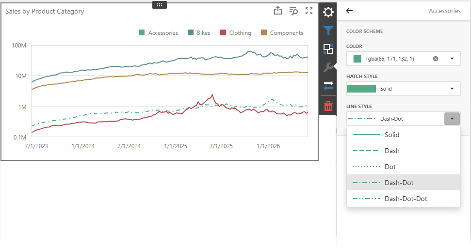

A new color scheme is applied to the dashboard item(s).

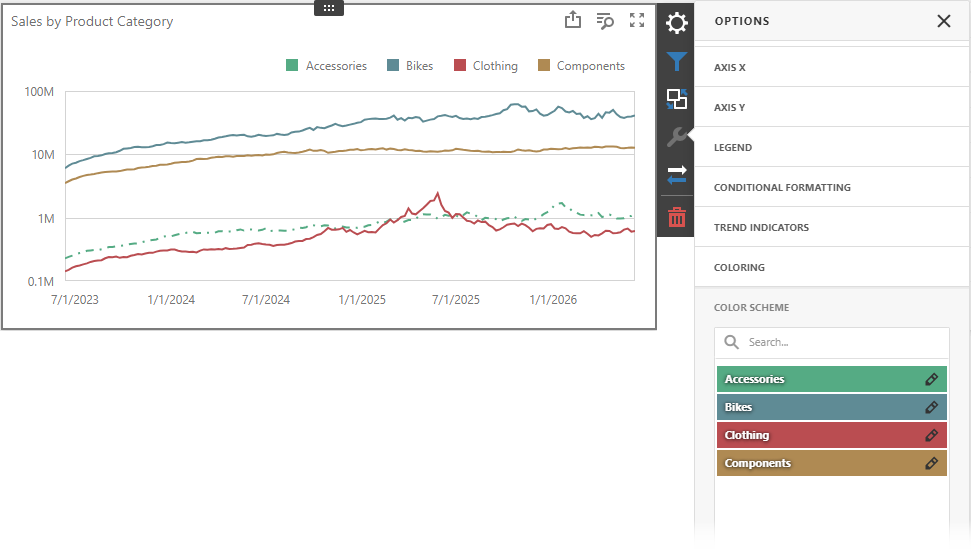

## Customize Color Palettes in the Color Scheme Page

The **Color Scheme** page of the [dashboard menu](../ui-elements/dashboard-menu.md) allows you to edit and add colors, hatch styles, and line styles to customize color tables.

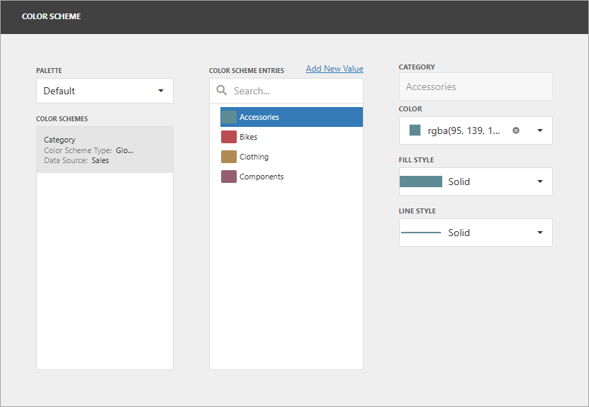

### Edit Color Scheme Entries

You can reassign color and style in the selected color table. For this, select one of the available schemes in the **Color Schemes** pane and click the item in the **Color Scheme Entries** pane.
	
If you click the **Color** dropdown button, it invokes a color picker where you can select a new color. 

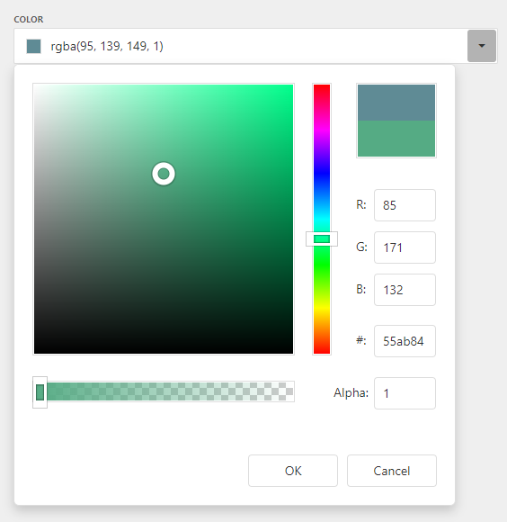

Click **OK** to change the automatically assigned color for the selected value and update the current color scheme.

You can also select the fill style (solid or a hatch pattern) for the selected color. To do this, use the **Fill Style** drop-down list:

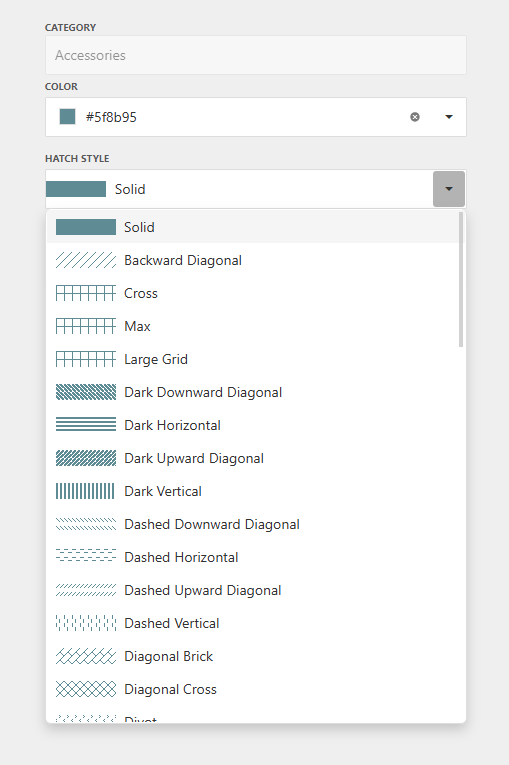

You can also select the line style for the selected color. To do this, use the **Line Style** drop-down list:

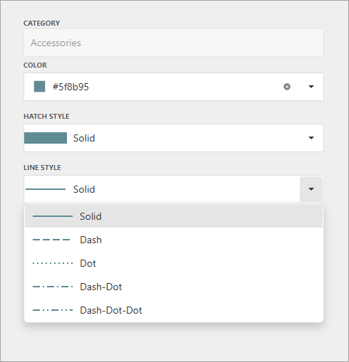

### Add Color Scheme Entries

The **Color Scheme** page allows you to add a new value with the specified color and styles to the selected color scheme. To do this, use the **Add New Value** button.

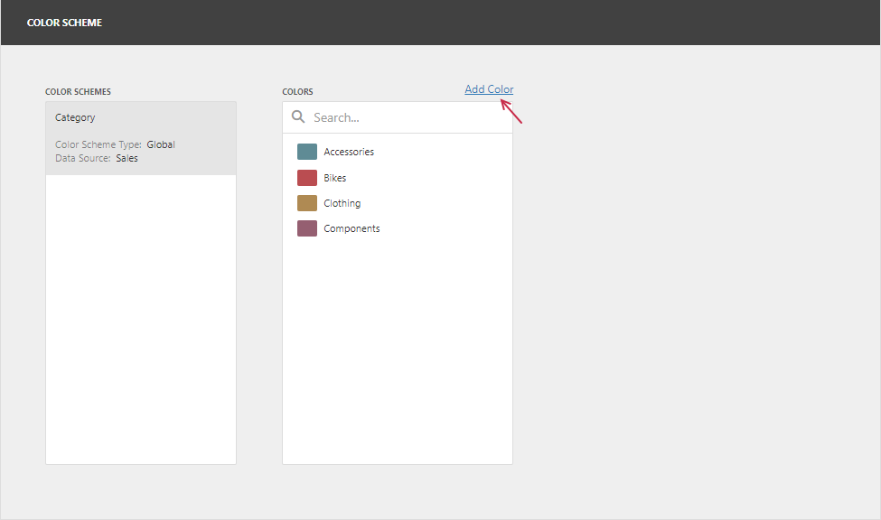

Specify the dimension value for the added color, or select the measures. This creates a new value whose color and styles you can specify as described in the **Edit Color Scheme Entries** section.

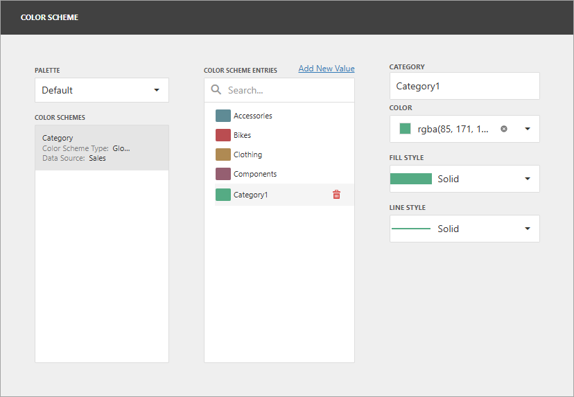

Click **Remove** to remove the color.
