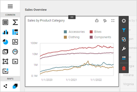

---
title: Themes
author: Natalia Kazakova
---
# Themes

The Web Dashboard control supports the *Generic*, *Generic Compact*, and *Material Design Compact* [DevExtreme themes](https://js.devexpress.com/DevExtreme/Guide/Themes_and_Styles/Predefined_Themes).

## Generic and Generic Compact Themes 

| Theme  | Image |
|---|---|
|Light |  |
|Dark |  |
|Carmine |  |
|Soft Blue |  |
|Green Mist |  |
|Dark Moon |  |
|Dark Violet |  |

## Material Design Themes

| Theme  | Image |
|---|---|
|Blue Light ||
|Lime Light ||
|Orange Light ||
|Purple Light ||
|Teal Light ||
|Blue Dark ||
|Lime Dark ||
|Orange Dark ||
|Purple Dark ||
|Teal Dark||
