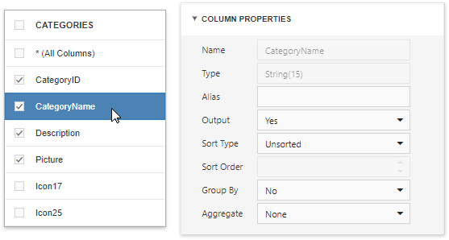
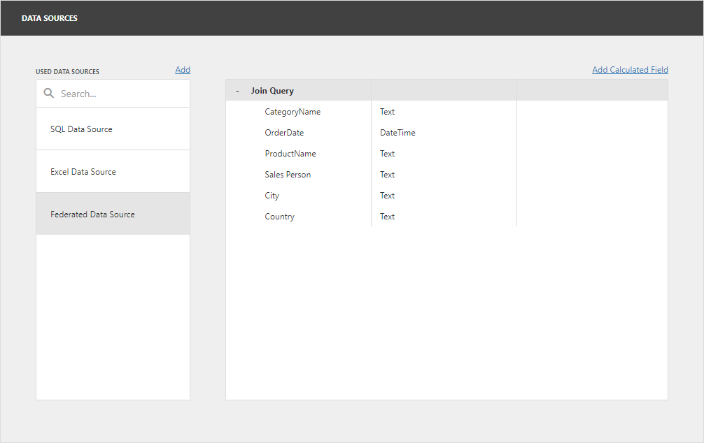

# Query Builder

The **Query Builder** is a visual query editor. You can use it to add data tables and views to the SQL data sources, and select which columns to include. For federated data sources, you can create a federated query.

## Query Builder for SQL Data Sources

### Add Tables

Drag a specific table or view to the Query Builder design surface pane to include it in a query:

Then select the columns to include in the query:

The Query Builder provides a toolbar with the following commands:

Icon | Description 
---------|----------
 | Removes the selected table or view from the query.
 | Reverses the most recent action. 
 | Restores the previously undone action.

### Join Tables
The Query Builder allows you to join tables and/or views. Use drag and drop to connect corresponding columns (key fields). A relationship line is drawn between two connected tables / views. Note the connected columns should have identical data types. The **Query Builder** automatically joins a table or view that has a relationship at database level with any recently added tables.

The Query Builder allows you to change the join type (if necessary). Click a relationship line to display the **Relation Properties** section. Properties in this section define the join type (**Inner** or **Left Outer**) and applied logical operator.

A left outer join returns all values from an inner join along with all values in the "left" table that do not match the "right" table. The result also includes rows with NULL (empty) values in the key field. If you select the left outer join, the relationship line displays an arrow which points to the "right" table of the join clause. The executed query returns a "flat" table that joins different tables within a single query.

Select the relationship line and click **Delete** (the  icon) to delete an unnecessary relationship.

### Edit Column Settings
Select a table or view, and click a data column to display the data column options.

The **Column Properties** section contains the following options:

Option | Description
---------|----------
 **Name** | Indicates the column name that the Query Builder obtains from the database. 
 **Type** | Indicates the column's data type. The Query Builder provides information about the maximum string length for string columns.
 **Alias** | Specifies a custom column name (alias). Include a column into a query to enable this option. Aggregated columns should always have an alias.
 **Output** | Specifies whether to include a column in a query result. 
 **Sort Type** | Specifies whether to maintain the initial sort order for a column, or sort data records in ascending or descending order. 
 **Sort Order** | Defines the sorting priority for multiple columns (the less this number is, the higher the priority).
 **Group By** | Specifies whether to group a query result by this column.
 **Aggregate** | Specifies whether to aggregate the column's data records. You can use the following aggregate functions: **Count**, **Max**, **Min**, **Avg**, **Sum**, **CountDistinct**, **AvgDistinct**, **SumDistinct**.  The Query Builder omits individual data records from the query result and only retains the aggregate function result when you apply any of these functions.

### Use Query Parameters

Use the **Parameters** section to add, remove and edit [query parameters](../../provide-data/working-with-sql-data-sources/pass-query-parameters.md).

Each query parameter allows you to configure the following properties:

Option | Description
---------|---------
**Name** | Specifies the query parameter's name.
**Type** | Specifies the parameter value's data type. Set this property to **Expression** to generate parameter values dynamically.
**Result Type** | Specifies the data type of the expression's result value. This property is enabled if the query parameter type is Expression.
**Value** | Determines the query parameter's actual value. You can specify a static value according to the selected value's data type. Alternatively, construct an expression to generate parameter values dynamically. Click this property's ellipsis button to invoke the **Expression Editor** and create an expression. This ellipsis button is enabled if you set the query parameter type to **Expression**.

### Filter Data
The Query Builder can be used to filter a query. To do this, deselect tables and click the ellipsis button in the invoked **Filter** field in the **Properties** pane. This invokes the **Filter Editor** dialog, which provides a visual interface for constructing a filter string.

See the following topic for details: [Filter Queries](../../provide-data/working-with-sql-data-sources/filter-queries.md).

### Preview Data
Click the **Preview Results** button to test a query on the actual data's limited subset.

The invoked [Data Preview](preview-data.md) dialog displays the first 100 data records of the query:

## Query Builder for Federated Data Sources

The Query Builder supports the following query types for the federated data source:

- **Join** - Combines rows from two or more sources based on a clause.
- **Union and Union All** - The **Union** query combines rows from two or more sources into one data set and removes duplicate rows in the merged source. The **Union All** query does the same, except it doesn't remove duplicated rows. You can create a union query for data sources if data types of their columns are [implicitly converted](https://docs.microsoft.com/en-us/dotnet/csharp/programming-guide/types/casting-and-type-conversions#implicit-conversions).
- **Transformation** - If a data source contains a complex column (an object), you can transform its properties to display them as separate columns in a flattened view. If one of the data columns is an array, you can unfold its values and display a new data row for every element of the array. When you unfold the column, you can flatten it and create a flattened view.

### Create a Join-Based Federated Data Source

In the invoked Query Builder, add the tables from the data sources (drag or double-click them). Use drag-and-drop to create a relationship based on the key field. Enable checkboxes for the data fields you want to include in the query result set.

You can also specify a different name for a field: set the alias in the Alias column for the corresponding field (for example, _City_ for the _ShipCity_ field on the image below).

In the image below columns from the two data sources are added to the query:

You can specify the expression for the field. For this, enable the **_f_** button and then click ellipsis button:

This invokes the Expression Editor and you can specify a [calculated field](../../provide-data/calculated-fields.md).

Click **OK** to close the Query Builder. Rename the created query if necessary. 

Click **Finish** to create the federated data source with the Join query and close the Data Source Wizard. Add the newly created data source to the dashboard to see the result:

### Create a Union-Based Federated Data Source

Double-click the Customers table and the Excel data source. The query includes only fields that have identical names and types in the origin sources. Enable the **Union All** check box to create the **Union All** query and do not remove duplicated rows. 

You can also specify a different name for a field: set the alias in the Alias column for the corresponding field.

In the image below, two sources are added to the query:

Click **OK** to close the Query Builder. Rename the created query if necessary.

Click **Finish** to create the federated data source with the Union/UnionAll query and close the Data Source Wizard. Add the newly created data source to the dashboard to see the result:

### Create a Transformation-Based Data Source

In the invoked Query Builder, select the data source or query that contains columns you want to transform. Select the Transform check box next to the column you need to unfold and flatten. You can specify the aliases for the generated columns.

In the image below the Query Builder transforms the `Products` column from the JSON data source:

Click **OK** to close the Query Builder. Rename the created query if necessary.

Click **Finish** to create the federated data source with the Transformation query and close the Data Source Wizard. Add the newly created data source to the dashboard to see the result:

