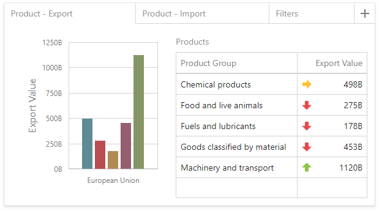

---
title: Tab Container
author: Natalia Kazakova
legacyId: 400300
---
# Tab Container

Like the Dashboard Item Group, the **Tab Container** dashboard item  allows you to combine elements within a dashboard. The main Tab Container's purpose is to split the dashboard layout into several pages.

Click the tab page's header to switch between tab pages:

