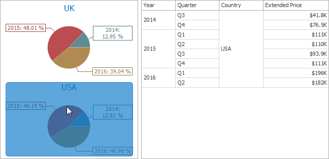
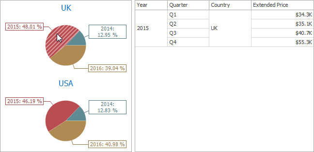

# Master Filtering
The **Dashboard** allows you to use any data aware dashboard item as a filter for other dashboard items (**Master Filter**). To learn more about filtering concepts common to all dashboard items, see the [Master Filtering](../../../interactivity/master-filtering.md) topic.

The **Pie** dashboard item supports filtering by **argument** or **series** values.

## Filtering by Arguments
When filtering by arguments is enabled, you can click a pie segment to make other dashboard items only display data related to the selected argument value.

To enable filtering by arguments in the Designer, set the required [Master Filter mode](../../../interactivity/master-filtering.md) and click the **Arguments** button in the **Data** Ribbon tab (or the  button if you are using the toolbar menu).

## Filtering by Series
When filtering by series is enabled, you can click a pie to make other dashboard items display only data related to the selected pie.

To enable filtering by series in the Designer, set the required [Master Filter mode](../../../interactivity/master-filtering.md) and click the **Series** button in the **Data** Ribbon tab (or the  button if you are using the toolbar menu).

## Filtering by Points
When filtering by points is enabled, you can click a single pie segment to make other dashboard items display only data related to the selected segment.

To enable filtering by points in the Designer, set the required [Master Filter mode](../../../interactivity/master-filtering.md) and click the **Points** button in the **Data** Ribbon tab.

## Reset Filtering
To reset filtering, use the **Clear Master Filter** button (the  icon) in the [caption](../../../dashboard-layout/dashboard-item-caption.md) area of the Pie dashboard item, or the **Clear Master Filter** command in the Pie's context menu.