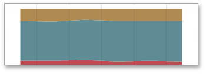

# Series
The **Range Filter** dashboard item supports various **Line** and **Area** series types.

To switch between series types in the Designer, click the options button next to the required data item in the **Values** section. In the invoked **Series Type** dialog, select the required series type and click **OK**.

You can also do this using the buttons in the **Series Type** group of the **Design** Ribbon tab.

The Range Filter supports the following series types.

**Line:**

**Stacked Line:**

**Full-Stacked Line**

**Area:**

**Stacked Area:**

**Full-Stacked Area:**

