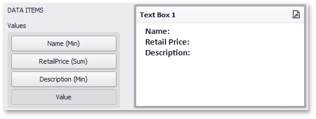

# Providing Data
The Text Box dashboard item can be [bound to data](../../bind-dashboard-items-to-data.md) as other data-aware dashboard items. To do this, perform the following steps.
1. Drop the _Name_, _RetailPrice_ and _Description_ data source fields from the _Products_ table to the **Values** section of the Text Box.
	
	
	
	Note that [summary types](../../data-shaping/summarization.md) of the created measures are **Min**, **Sum** and **Min**, respectively.
2. Click the [Edit](editing-text.md) button in the **Design** ribbon tab and add the _Name_, _Retail Price_ and _Description_ strings to the document.
	
	
3. Place the pointer next to _Name_, right-click the document and select **Insert Field** (or use the [Insert Field](editing-text.md) button in the ribbon). Then, click the _Select value_ placeholder and select the _Name (Min)_ measure.
	
	
4. Perform the third step for _Retail Price_ and _Description_.
	
	
5. Click the [Edit](editing-text.md) button again to leave the editing mode. The Text Box will show data in the following way.
	
	
	
	You can use this Text Box as a detail item along with the [Master Filtering](interactivity.md) feature to filter data according to the selected product.