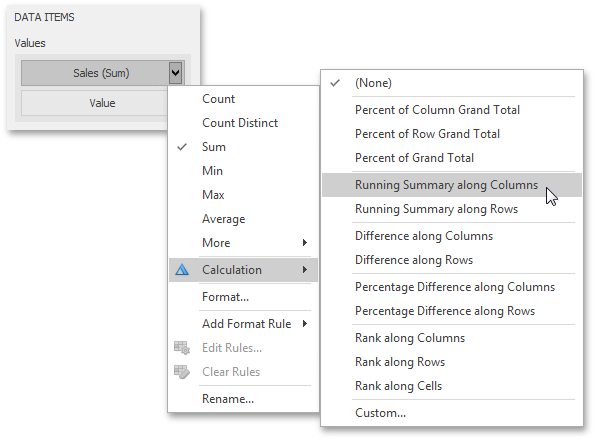
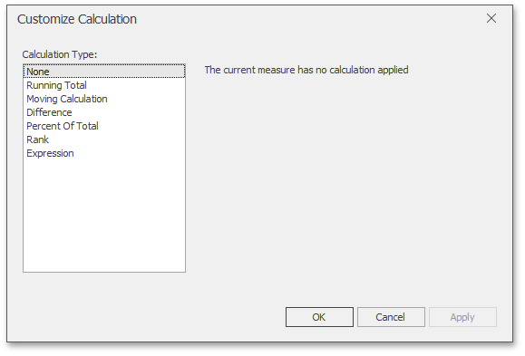
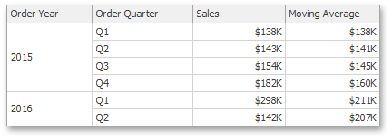
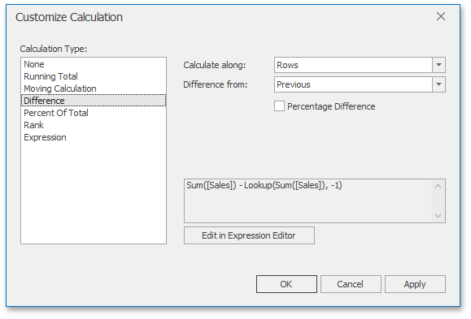
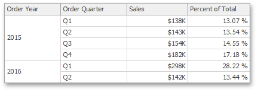

# Creating Window Calculations
The Dashboard Designer allows you to add a [window calculation](window-calculations-overview.md) for numeric measures. To do this, invoke the [data item menu](../../ui-elements/data-items-pane.md) and select the required calculation type.

The image above shows a calculation menu of the [Pivot](../../dashboard-item-settings/pivot.md) dashboard item. The following items are available.
* **Percent of Column Grand Total** - Calculates a contribution of individual measure values to a column grand total.
* **Percent of Row Grand Total** - Calculates a contribution of individual measure values to a row grand total.
* **Percent of Grand Total** - Calculates a contribution of individual measure values to a grand total.
* **Running Summary along Columns** - Calculates a cumulative total for measure values along columns (horizontally).
* **Running Summary along Rows** - Calculates a cumulative total for measure values along rows (vertically).
* **Difference along Columns** - Calculates differences between measure values along columns (horizontally).
* **Difference along Rows** - Calculates differences between measure values along rows (vertically).
* **Percent Difference along Columns** - Calculates percentage differences between measure values along columns (horizontally).
* **Percent Difference along Rows** - Calculates percentage differences between measure values along rows (vertically).
* **Rank along Columns** - Ranks measure values along columns (horizontally).
* **Rank along Rows** - Ranks measure values along rows (vertically).
* **Rank along Cells** - Ranks measure values along cells (throughout the entire pivot table).
* **Custom...** - Allows you to create a custom calculation by specifying various settings. Clicking this item invokes the **Customize Calculation** dialog that allows you to add additional customizations to calculations.
	
	
	
	To learn more, see descriptions of the available calculations below.

> [!NOTE]
> Note that the list of available items in this menu can be changed by the Dashboard Designer dynamically. For instance, if the Pivot dashboard item does not contain dimensions in the **Rows** section, menu items related to rows will be disabled.

## Running Total
The Running Total calculation can be used to compute a cumulative total for the specified measure across a [window](window-definition.md). For example, the Grid below displays cumulative sales across all quarters.

The Customize Calculation dialog provides the following settings for the Running Total calculation.

* **Running along** - Specifies a [window and direction](window-calculations-overview.md) used to calculate running totals.
* **Summary function** - Specifies a summary function used to apply calculation. To learn more about the available summary functions, see the **Summary Function Types** in the [summary function](../../data-shaping/summarization.md) topic.

## Moving Calculation
The Moving calculation uses neighboring values to calculate a total. For example, the Grid below shows a moving average across all quarters.

The Customize Calculation dialog provides the following settings for the Moving calculation.

* **Moving along** - Specifies a [window and direction](window-definition.md) used to apply a calculation.
* **Summary function** - Specifies a summary function used to apply a calculation. To learn more about the available summary functions, see the **Summary Function Types** in the [summary function](../../data-shaping/summarization.md) topic.
* **Start offset** / **End offset** - Specify start/end offsets from the currently processed value. For instance, if you specified offsets as 1/1, the previous and next values will be used along with the current value to apply the Moving calculation.

## Difference
The Difference calculation can be used to compute the difference between measure values across a [window](window-definition.md). For example, the Grid below shows absolute differences between quarterly sales.

The Customize Calculation dialog provides the following settings for the Difference calculation.

* **Calculate along** - Specifies a [window and direction](window-calculations-overview.md) used to calculate differences.
* **Difference from** - Specifies the value used to calculate the difference. The following values are available: _Previous_, _Next_, _First_ and _Last_.
	
	You can also use the **Percent Difference** option to specify whether the absolute or percentage difference is displayed.

## Percent of Total
A calculation is used to compute a percentage of the total for the specified measure across a [window](window-definition.md). For example, the Grid below shows a contribution of individual quarterly sales to total sales.

The Customize Calculation dialog provides the following settings for the Percent of Total calculation.

* **Percent of Total** - Specifies a [window and direction](window-calculations-overview.md) used to apply a Percent of Total calculation.

## Rank
Use the Rank calculation to compute rankings for the specified measure across a [window](window-definition.md). For example, the Grid below shows a ranking of sales for individual quarters.

The Customize Calculation dialog provides the following settings for the Rank calculation.

* **Rank along** - Specifies a [window and direction](window-calculations-overview.md) used to rank values.
* **Rank type** - Specifies the type of ranking. The following rank types are available: _Unique_, _Competition_, _Dense_, _Modified_ and _Percentile_.
* **Order** - Specifies the order of ranking. You can select _Ascending_ or _Descending_.

## Expression
Use Expression to specify a custom calculation by adding the required [calculation functions](calculation-functions-reference.md) inside the measure expression.

Click the **Edit in Expression Editor** button to invoke the **Expression Editor** and specify the required [expression](../../data-analysis/expression-constants-operators-and-functions.md).

The Expression type provides the **Calculate along** option that specifies the [window and direction](window-calculations-overview.md) used to calculate differences. Note that this option is in effect if the expression contains a [calculation function](calculation-functions-reference.md).