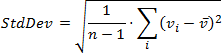

# Summarization
To obtain numeric values that should be displayed within a dashboard item, Dashboard calculates a summary function against the specified measure.

This topic describes how to specify which summary function should be calculated against a particular measure.

The following sections are available.
* [Summary Function Types](#summaryfunctiontypes)
* [Changing Summary Type](#changingsummarytype)

## <a name="summaryfunctiontypes"/>Summary Function Types
The following summary functions are available.
* **Count** - The number of values (excluding **Null** and **DBNull** values).
	
	This is the only summary type that can be calculated against non-numeric data.
* **Count Distinct** - The number of distinct values.
* **Sum** - The sum of the values.
	
	
* **Min** - The smallest value.
* **Max** - The largest value.
* **Average** - The average of the values.
	
	
* **StdDev** - An estimate of the standard deviation of a population, where the sample is a subset of the entire population.
	
	
* **StdDevP** - The standard deviation of a population, where the population is the entire data to be summarized.
	
	
* **Var** - An estimate of the variance of a population, where the sample is a subset of the entire population.
	
	
* **VarP** - The variance of a population, where the population is the entire data to be summarized.
	
	
* **Median** - The _median_ of the values (excluding **Null** and **DBNull** values).  A _median_ is the number separating the higher half of a value range from the lower half.

## <a name="changingsummarytype"/>Changing Summary Type
By default, Dashboard calculates **Sum** for numeric measures and **Count** for measures that contain another type of data.

You can change the summary function type for numeric measures. To do this in the Designer, invoke the data item menu and select the desired summary type. Less common summary types are organized in the **More** submenu.

