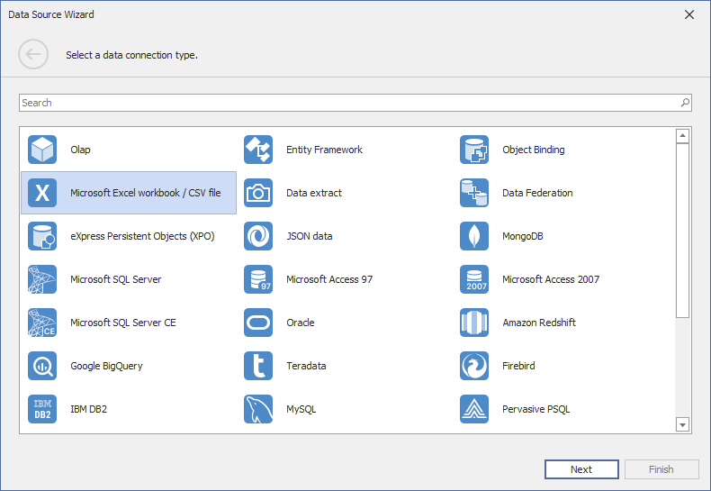

# Binding to Microsoft Excel Workbooks
The Dashboard Designer allows you to select required data from Microsoft Excel workbooks (XLS, XLSX or XLSM). You can select all data from the specified worksheet or you can select the cell range referenced by the specified defined/table name.

To bind a dashboard to a Microsoft Excel workbook, do the following.
1. Click the **New Data Source** button in the **Data Source** ribbon tab.
	
	
2. On the first page of the invoked **Data Source Wizard** dialog, select **Microsoft Excel workbook / CSV file** and click **Next**.
	
	
3. On the next page, locate the required workbook by clicking an ellipsis button and selecting the file.
	
	
	
	Click **Next**.
	
	> [!NOTE]
	> If the workbook is protected by a password, the following window will be invoked.
	> 
	> 
	> 
	> Specify a password in the **Password** field and click **OK**. Note that if you enable the **Save password** flag, the password will be saved to a [dashboard definition](../save-a-dashboard.md) as plain text.
4. Then, specify import settings used to extract data from the workbook.
	
	
	
	The following options can be specified.
	* **Use values of the first row as field names** - Specifies whether to use the values of the first row as field names. If you disable this option, field names will be generated automatically.
	* **Skip empty rows** - Specifies whether or not to include the empty rows into the resulting data source.
	* **Skip hidden rows** - Specifies whether to ignore hidden rows when importing data to a data source.
	* **Skip hidden columns** - Specifies whether to ignore hidden columns when importing data to a data source.
	
	Click **Next**.
5. On the next page, you can select the worksheet containing the required data, the table or the defined name referring to the specified cell range.
	
	
	
	Click **Next**.
6. On the final page, you can select columns to be included to a data source and specify their settings. The **Name** column allows you to specify the column name while **Type** allows you to specify its type.
	
	
	
	Click **Finish** to create a data source. This creates the data source and displays its fields in the [Data Source Browser](../ui-elements/data-source-browser.md).