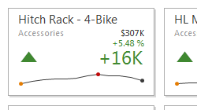
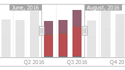
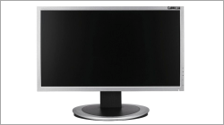
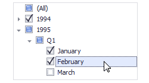

# Data Presentation Basics
The **Dashboard Viewer** is used to present dashboards in Windows Forms applications. 
A wide range of dashboard items are used to display visual or textual information.

| Dashboard Item | Image | Description |
|---|---|---|
| [Chart](../dashboard-items/chart.md) |  | Displays data graphically using bars, lines, points, etc. |
| [Scatter Chart](../dashboard-items/scatter-chart.md) |  | Visualizes relationships between numeric variables. |
| [Grid](../dashboard-items/grid.md) |  | Presents data in tabular form. |
| [Pies](../dashboard-items/pies.md) |  | Displays a series of pies or donuts that represent the contribution of each value to the total. |
| [Cards](../dashboard-items/cards.md) |  | Displays a series of cards, each illustrating the difference between two values. |
| [Gauges](../dashboard-items/gauges.md) |  | Visualizes data within a series of gauges. |
| [Pivot](../dashboard-items/pivot.md) |  | Displays cross-tabular reports and allows you to analyze multi-dimensional data. |
| [Choropleth Map](../dashboard-items/choropleth-map.md) |  | Colorizes areas in proportion to the provided values. |
| [Geo Point Map](../dashboard-items/geo-point-maps/data-presentation-basics.md) |  | Displays callouts on the map using geographical coordinates. |
| [Bubble Map](../dashboard-items/geo-point-maps/data-presentation-basics.md) |  | Displays bubbles on the map using geographical coordinates. |
| [Pie Map](../dashboard-items/geo-point-maps/data-presentation-basics.md) |  | Places pies on the map using geographical coordinates. |
| [Range Filter](../dashboard-items/range-filter.md) |  | Allows you to apply filtering by dragging selection thumbs along the argument axis. |
| [Images](../dashboard-items/image.md) |  | Displays images. |
| [Text Box](../dashboard-items/text-box.md) |  | Displays rich text within a dashboard. |
| [Treemap](../dashboard-items/treemap.md) |  | Visualizes data in nested rectangles. |
| [Combo Box](../dashboard-items/filter-elements.md) |  | Allows you to select a value(s) from the drop-down list. |
| [List Box](../dashboard-items/filter-elements.md) |  | Allows you to select a value(s) from the list. |
| [Tree View](../dashboard-items/filter-elements.md) |  | Displays values in a hierarchical way and allows you to filter other dashboard items by selecting parent/child values. |

The Dashboard Viewer enables interaction between various dashboard items. These features include **Master Filtering** and **Drill-Down**.
* [Master Filtering](master-filtering.md)
* [Drill-Down](drill-down.md)

You can inspect raw or aggregated data. See the [Data Inspector](data-inspector.md) topic for details.

To learn more about the dashboard layout, see the [Dashboard Layout](dashboard-layout.md) topic.