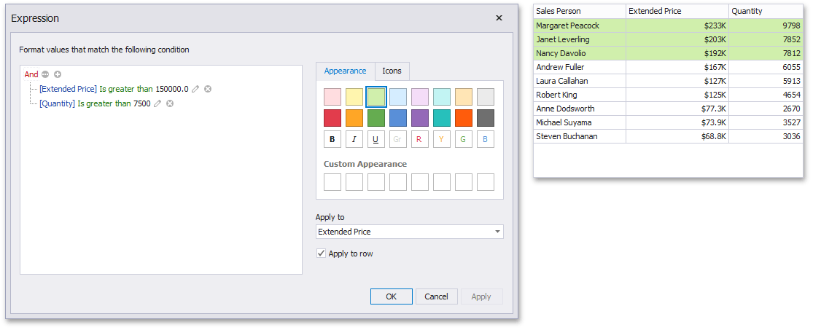

# Expression
An Expression format condition allows you to use complex conditions to apply formatting.

To format values according to the Expression condition, click the menu button of the required data item and select **Add Format Rule | Expression**.

This invokes the **Expression** dialog that allows you to specify the required expression. For instance, the following image displays a **Grid** dashboard item whose rows are filled in green if the Extended Price/Quantity values are greater than 150 000 and 7 500, respectively.

You can pass static values when creating conditions or pass a dashboard parameter to apply conditional formatting dynamically. To learn more, see [Passing Parameter Values](../../data-analysis/using-dashboard-parameters/passing-parameter-values.md).