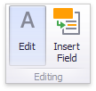

---
title: Editing Text
author: Natalia Kazakova
legacyId: 16861
---
# Editing Text
To edit the text within the Text Box, click the **Edit** button in the ribbon's **Design** tab or use the corresponding item in the context menu.

This adds the **Text Box Editor** context category to the Dashboard Designer's ribbon and allows you to modify the content within the Text Box.

<<<<<<<< HEAD:eud-for-bi-dashboards/dashboard-for-desktop/dashboard-designer/dashboard-item-settings/text-box/editing-text.md
<!-- To learn how to edit the content within the Text Box, see [Rich Text Editor](~/interface-elements-for-desktop/rich-text-editor.md) - Link disabled: interface-elements not included.  After you change the document, click **Edit** again to finish editing.-->
========
<!-- To learn how to edit the content within the Text Box, see [Rich Text Editor](~/interface-elements-for-desktop/articles/rich-text-editor.md) - Link disabled: interface-elements not included.  After you change the document, click **Edit** again to finish editing.-->
>>>>>>>> 05df5c28763b4aa9fb5c78d15422603198f71820:eud-for-bi-dashboards/dashboard-for-desktop/articles/dashboard-designer/dashboard-item-settings/text-box/editing-text.md

> [!NOTE]
> Note that the Text Box can be [bound](../../bind-dashboard-items-to-data.md) to data. To learn how to do this, see [Providing Data](providing-data.md).