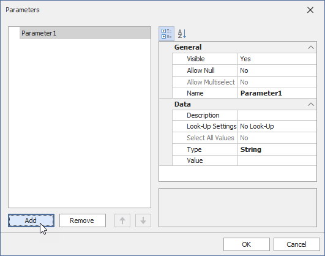
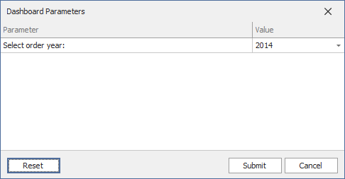
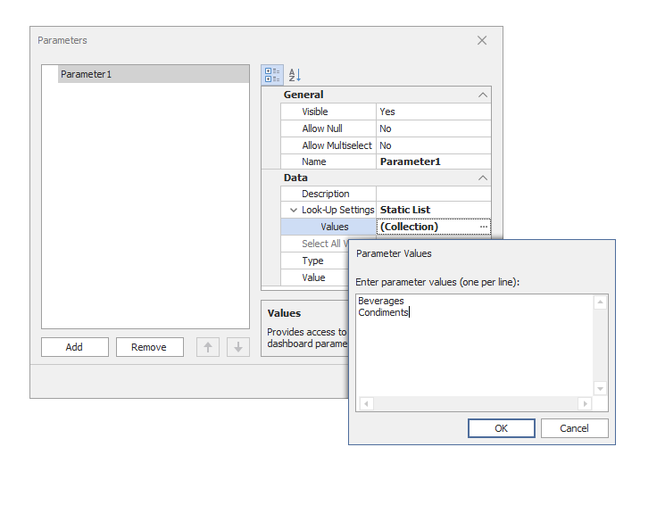
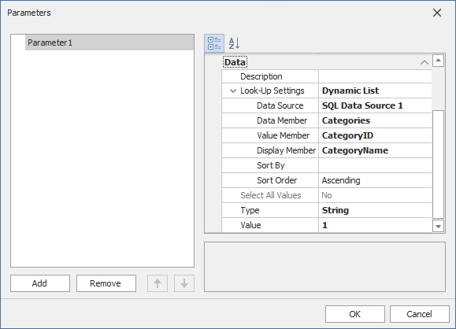

# Create a Dashboard Parameter in the WinForms Designer

This topic shows how to add a new dashboard parameter and specify its settings in the Dashboard Designer.

## Create a Parameter in the UI

To create dashboard parameters in the Dashboard Designer, follow the steps below.

1. Click the **Parameters** button from the **Dashboard** page group on the Ribbon's **Home** page.
	
	

2. In the invoked dialog, click the **Add** button to create a dashboard parameter.
	
	

3. Specify the parameter's settings and click **OK** to save the created parameter.

## Parameter Settings

### Name

Specifies the parameter name.

When you create and modify parameter names, follow the rules below:

* A name can contain letters, numbers, and underscores.
* A name cannot contain spaces.
* A name cannot be an empty string.
* The dashboard cannot contain parameters with the same name.
* Names are case-sensitive. For example, you can create the names _Parameter_ and _PARAMETER_ .

### Description

Specifies the parameter description displayed in the **Parameter** column of the [Dashboard Parameters](requesting-parameter-values.md) dialog.

	
### Visible

Specifies whether the parameter is visible in the [Dashboard Parameters](requesting-parameter-values.md) dialog.

### Allow Null

Specifies whether a null value can be passed as a parameter value.
	
### Allow Multiselect

Specifies whether multi-selection is enabled for the current parameter.

The following limitations apply to parameters with multi-selection enabled:

* Use the **Is any of** or **Is none of** operators to pass a multi-select parameter to a filter criteria or to the Expression format condition.
* Use the **In** or **Not In** operators to pass a multi-select parameter to a calculated field expression.

### Select All Values

Specifies whether all parameter values should be selected in the initial state of the dashboard.
	
Note that this option is in effect when **Allow Multiselect** is enabled.

### Type

Specifies the parameter type.

The following types are available:
* String
* Date
* Number (16-bit integer)
* Number (32-bit integer)
* Number (64-bit integer)
* Number (floating point)
* Number (double-precision floating point)
* Number (decimal)
* Boolean
* GUID (Globally Unique Identifier)
  
### Value

Specifies the default parameter value.
	
Note that when the **Allow Multiselect** option is enabled, the **Value** option allows you to select multiple parameter values.

### Look-Up Settings

Specifies the parameter's look-up settings.

	
Select the option from the **Look-Up Settings** drop-down list.

The following **Look-Up Settings** are available in the WinForms Dashboard:

#### No Look-Up

An end user can specify the parameter value in the [Dashboard Parameters](requesting-parameter-values.md) dialog.

You can set the default value for the parameter in the parameter setting:

#### Static List

An end user selects a parameter value from a static list. 

To add predefined parameter values, click the ellipsis button in the parameter settings:
	

#### Dynamic List 

An end user selects a parameter value defined in a data source.
	

>[!TIP]
>You can also create cascading parameters in the Dashboard Designer. For more information, refer to the following topic: [Cascading Parameters](create-cascading-parameters.md).

To provide access to data source values, specify the following options:

|UI Settings|Description|
|--------|-----------|---|
|**Data Source**| Specifies the data source for the dashboard parameter.|
|**Data Member**| Specifies the name of the data member with the parameter values for SQL and Entity Framework data sources.|
|**Value Member**|Specifies the name of the data field for the parameter values.|
|**Display Member** (optional)| Specifies the name of the data field displayed in the **Dashboard Parameters** dialog as a value description.|
|**Sort By** (optional)|Specifies the data member used to sort parameter values.|
|**Sort Order** (optional)|Specifies the sort order.|

> [!NOTE]
> You cannot use an OLAP data source as the data source for a dashboard parameter.

