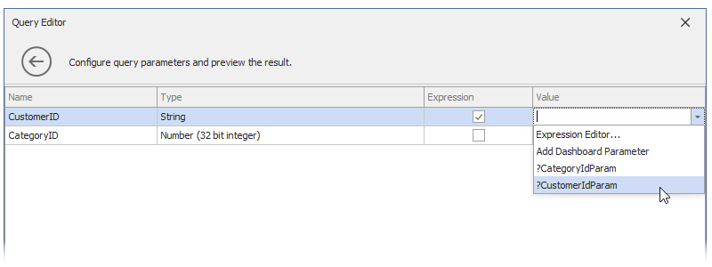
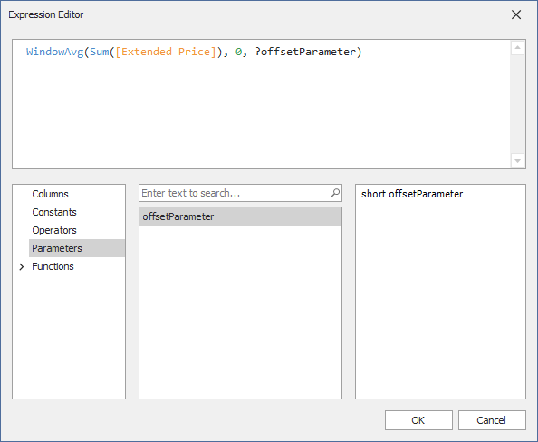

# Reference Dashboard Parameters in WinForms

This topic describes how to reference a [dashboard parameter](creating-parameters.md) in [condition format expressions](#conditional-formatting), [calculated fields](#calculated-fields), and [window calculations](#window-calculations). You can also bind a dashboard parameter to a query parameter to filter the SQL data source dynamically.

## SQL Queries and Stored Procedures
You can filter the SQL data sources dynamically if you bind a [query parameter](../../work-with-data/pass-query-parameters.md) to a dashboard parameter.

You can access the query parameter settings in the second page of the [Query Editor](../../work-with-data/using-the-query-editor.md) or in the [Query Builder](../../work-with-data/using-the-query-builder.md) by clicking the **Edit Parameters** button. 

Select the *Expression* checkbox and in the **Value** column, select the dashboard parameter, or specify an expression with a dashboard parameter in **Expression Editor**.
	

Refer to the following article for more information about query parameters: [Use Query Parameters](../../work-with-data/pass-query-parameters.md).

>[!TIP]
>You can also create cascading parameters in the WinForms Dashboard Designer. For more information, refer to the following topic: [Cascading Parameters](create-cascading-parameters.md).

## Data Source Filtering

You can use dashboard parameters to filter Excel, Object, and Extract data sources.

To apply filtering to a data source, click the **Filter** button in the **Data Source** Ribbon tab.

In the invoked [Filter Editor](../../ui-elements/filter-editor/filter-data-via-the-filter-editor.md), specify the filter criteria. To compare a field value with a parameter value, click the  button and then the  button. Then, click the second operand's placeholder to invoke the list of available parameters and select the required parameter:

The  icon will be displayed next to the selected parameter.

Click **OK** to save the created filter criteria. Now, when you change the dashboard parameter value, the data source is filtered according to the parameter value.

## Conditional Formatting

You can apply [conditional formatting](../../appearance-customization/conditional-formatting.md) to a dashboard item according to the current parameter value. It allows you to format dashboard item elements dynamically.  

To reference a dashboard parameter in a [format rule](../../appearance-customization/conditional-formatting.md#create-and-edit-a-format-rule), click the menu button of the required data item and select **Add Format Rule | Expression**:

In the invoked **Expression** dialog, specify the format rule and other settings. To compare a field value to a parameter value, click the  button of the second operand, and then click the  button. After that, click the operand's placeholder and select the dashboard parameter.

The  icon will be displayed next to the selected parameter.

Click **OK** to save the created format rule. Now, when you change the dashboard parameter value, the dashboard item is formatted according to the parameter value.

>[!TIP]
>For more information on conditional formatting, refer to the following article: [Conditional Formatting](../../appearance-customization/conditional-formatting.md).

## Calculated Fields

You can use parameters when you construct [expressions](../../data-analysis/expression-constants-operators-and-functions.md) for [calculated fields](../../work-with-data/creating-calculated-fields.md). This allows you to dynamically evaluate values of the calculated field depending on the current parameter value. 

To reference a dashboard parameter in the calculated field expression, add or edit a calculated field. In the invoked **Expression Editor**, select the dashboard parameter from the **Parameters** section.

Click **OK** to save the expression. Now, when you change the dashboard parameter value, the calculated field values are changed according to the specified expression.

>[!TIP]
>For more information on calculated fields in WinForms Dashboard, refer to the following article: [Calculated Fields](../../work-with-data/creating-calculated-fields.md).

## Window Calculations

You can use dashboard parameters in [window calculations](../../data-analysis/window-calculations/window-calculations-overview.md). This allows you to apply specific computations to measure values depending on the current parameter value.

To reference the dashboard parameter value in a window calculation, create a window calculation of the **Custom** type:

Then, select the calculation type and click the **Edit in Expression Editor** button:

In the invoked **Expression Editor** window, construct an expression. To reference a dashboard parameter, select the **Parameters** category and double-click the required parameter from the list of the available dashboard parameters.

Click **OK** to apply the specified settings. Now, when you change the dashboard parameter value, the calculation values are changed according to the specified expression.

>[!TIP]
>For more information on window calculations in WinForms Dashboard, refer to the following article: [Window Calculations](../../data-analysis/window-calculations.md).
