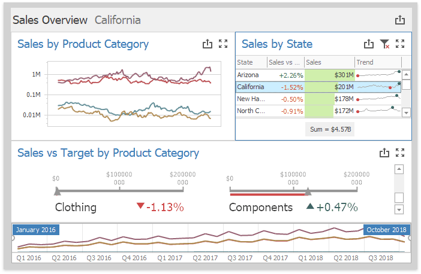

---
title: Dashboard Surface
author: Margarita Zakhodyaeva
---

# Dashboard Surface

The **Dashboard Surface** is the rectangular area that displays the dashboard that you are designing. This area includes [dashboard items](../dashboard-item-settings.md) and the [dashboard title](../dashboard-layout/dashboard-title.md).

You can configure a dashboard layout in the UI:

* [Dashboard Items Layout](../dashboard-layout/dashboard-items-layout.md) 
* [Dashboard Layout](../dashboard-layout.md)
