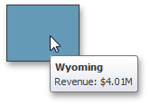

# Data Presentation Basics
The **Choropleth Map** dashboard item colorizes map areas in the following two ways.
* Based on the values provided.
	
	
* By indicating the difference between the actual and target values of a particular parameter.
	
	

You can switch between the provided values using the **Values** button (the  icon) in the map's [caption](../../data-presentation/dashboard-layout.md) area, or by using the context menu.

## Map Zooming and Scrolling
You can use the mouse wheel to change the current zoom level for the map. To scroll the map, hold down the left mouse button and drag it.

To move to the initial zooming and scrolling state, select the **Initial Extent** menu item in the map's context menu.

## Tooltip
The **Choropleth Map** dashboard item can display a tooltip that shows information on a hovered area.

