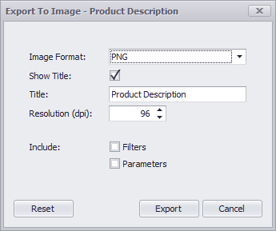

# Printing and Exporting
**Dashboard** allows you to print/export individual dashboard items, or the entire dashboard. To learn more about printing and exporting concepts common to all dashboard items, see the [Printing and Exporting](../../printing-and-exporting.md)
 topic.

This topic describes the specifics of printing/exporting a **Text Box** dashboard item.
* [Printing](#printing)
* [Export To PDF](#export-to-pdf)
* [Export To Image](#export-to-image)

## <a name="printing"/>Printing
If you are printing a Text Box dashboard item using the [Print Preview](../../../dashboard-designer/ui-elements/print-preview.md), you can customize the following options (via the **Options** button) before printing.

* **Show Title** - Specifies whether or not to apply the dashboard item caption to the printed document title.
* **Title** - Specifies the title of the printed document.
* **Include | Filters** - Allows you to include master filter values to the printed document.
* **Include | Parameters** - Allows you to include parameter values to the printed document.
* **Position** - Specifies the position of the master filter and parameter values in the printed document. You can select between _Below_ and _Separate Page_.

Specify the required options in the **Options** dialog and click the **Submit** button to apply the changes. To reset changes to the default values, click the **Reset** button.

## <a name="export-to-pdf"/>Export To PDF

* **Page Layout** - Specifies the page orientation used to export a dashboard item.
* **Size** - Specifies the standard paper size.
* **Show Title** - Specifies whether or not to apply the Text Box caption to the exported document title.
* **Title** - Specifies the title of the exported document.
* **Include | Filters** - Allows you to include master filter values to the exported document.
* **Include | Parameters** - Allows you to include parameter values to the exported document.
* **Position** - Specifies the position of the master filter and parameter values in the exported document. You can select between _Below_ and _Separate Page_.

Specify the required options in this dialog and click the **Export** button to export the Text Box dashboard item. To reset changes to the default values, click the **Reset** button.

## <a name="export-to-image"/>Export To Image

* **Image Format** - Specifies the image format in which the dashboard item is exported.
* **Show Title** - Specifies whether or not to apply the Text Box caption to the exported document title.
* **Title** - Specifies the title of the exported document.
* **Resolution (dpi)** - Specifies the resolution (in dpi) used to export the dashboard item.
* **Include | Filters** - Allows you to include master filter values to the exported document.
* **Include | Parameters** - Allows you to include parameter values to the exported document.

Specify the required options in this dialog and click the **Export** button to export the Text Box dashboard item. To reset changes to the default values, click the **Reset** button.